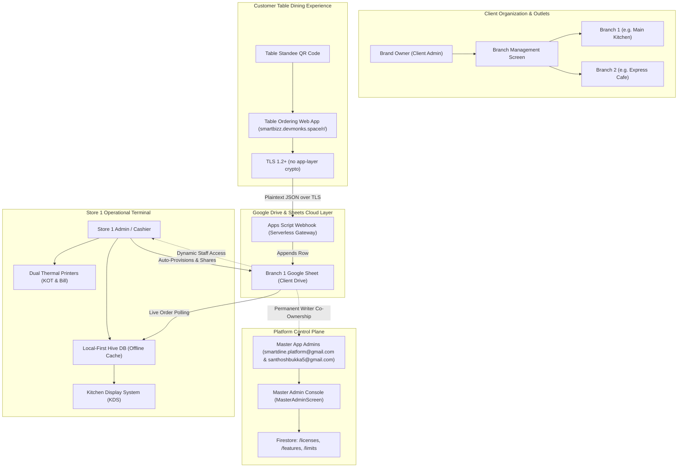

# SmartDine POS: Enterprise Architecture & Technical Specifications

> **Comprehensive Architectural Blueprint, Security Protocols, Google Drive Automation, and Data Models for SmartDine Restaurant POS.**

---

## 🏛️ 1. High-Level System Architecture



---

## 🏢 2. Multi-Tenant Organizational Hierarchy

SmartDine enforces a strict 4-tier tenant governance hierarchy that isolates operational data between restaurant chains, branches, and individual staff terminals:

### Tier 1: Platform Master Administrator
- **Primary Account**: `santhoshbukka5@gmail.com`
- **Responsibilities**:
  - Global client onboarding review and license provisioning.
  - Real-time plan extensions (+7, +14, +30, +365 days, custom date).
  - Advance expiry warning threshold configuration (`expiryWarningDays`).
  - Feature toggling and system-wide audit monitoring.
  - Permanent `writer` co-ownership on every provisioned client Google Sheet.

### Tier 2: Client Organization (Brand Owner)
- **Primary Account**: Client's Registered Google Account.
- **Responsibilities**:
  - Multi-outlet branch onboarding (up to `license.maxFranchises`).
  - Consolidated multi-store sales analytics.
  - Active outlet context switching without re-authenticating.
  - Assigning default Store Admins for individual branches.

### Tier 3: Restaurant Outlet / Branch
- **Primary Account**: Assigned Store Admin.
- **Scope**: Dedicated dining floor layout, table counts, specific thermal printer configurations, and unique UPI payment VPAs.
- **Database**: Dedicated Google Sheet in Google Drive (`SmartDine_{BranchName}_{OutletId}`).

### Tier 4: Station Staff Users
- **Authentication**: Google Sign-In with 4-Digit Quick PIN login.
- **Operational Roles**:
  - `OWNER`: Full administrative privileges.
  - `MANAGER`: Menu updates, staff roster, shift reconciliation.
  - `BILLING`: Fast counter checkout, bill settlement, receipt printing.
  - `KITCHEN`: Kitchen Display System (KDS), dish readiness updates.
  - `WAITER`: Floor layout, table order taking, waiter call servicing.

---

## 💾 3. Data Storage & Local-First Offline Resilience

SmartDine employs a **hybrid local-first cloud architecture**:

```
┌─────────────────────────────────────────────────────────┐
│                    Flutter POS Terminal                 │
│                                                         │
│  ┌────────────────────┐         ┌────────────────────┐  │
│  │    In-Memory State │ <-----> │  Hive Local Boxes  │  │
│  │   (Riverpod State) │         │ (Zero Latency Disk)│  │
│  └──────────┬─────────┘         └────────────────────┘  │
└─────────────┼───────────────────────────────────────────┘
              │ 
              ▼ Asynchronous Cloud Sync
┌─────────────────────────────────────────────────────────┐
│                Zero-Cost Cloud Backend                  │
│                                                         │
│  ┌────────────────────┐         ┌────────────────────┐  │
│  │ Google Drive & API │ <-----> │ Google Apps Script │  │
│  │   (7-Tab Sheet)    │         │  Webhook Gateway   │  │
│  └────────────────────┘         └────────────────────┘  │
└─────────────────────────────────────────────────────────┘
```

### Local Storage (Hive Boxes)
1. `configBox`: SaaS tenant session, active branch ID, printer MAC addresses, offline credentials.
2. `restaurant_auth_box`: Staff roster, multi-role definitions, and salted SHA-256 PIN hashes.
3. `restaurant_config_box`: Dynamic store settings, tax rates, GST configuration, and active UPI ID.
4. `outbox_queue` & `outbox_dead`: Offline mutation queue with exponential backoff, jitter, and dead-letter fault isolation. Started from `main()` via `Outbox.startAutoDrain()`; drains every 30s and immediately on regained connectivity. **Partial coverage:** the waiter round-dispatch and table-settlement paths enqueue on failure; the counter-billing and KDS paths do not yet.
5. `kot_orders_$orgId`: Cached KOT order tickets and dining bill records with monotonic lifecycle ranking.
6. `restaurant_tables_$orgId`: Table numbers, dining room sections, active sessions, and preserved printed QR URLs.

### Cloud Operational Engine (Google Sheets + Apps Script `Code.gs`)
- **Single Canonical Backend**: `google_apps_script/Code.gs` is the authoritative cloud operational gateway. All operational mutations (orders, tables, bills, settlements, voids) flow through `Code.gs`.
- **Zero-Firebase Operational Truth**: Firebase is strictly reserved for SaaS metadata (licenses, organizations, subscription plans, app versions). All operational revenue and dining data resides 100% in Google Sheets and local Hive caches.
- **Offline Outbox & Idempotency**: Every client mutation generates a unique `clientRequestId`. The `Outbox` processes mutations with exponential backoff (up to 300s) + jitter, and operations failing >8 times are isolated in `outbox_dead`. The same `clientRequestId` is reused on retry, so the server's `Idempotency` ledger collapses a retry of a request that did in fact arrive. **Not every write path routes through it yet** - see §Hive boxes above for current coverage.

### 11-Column Sheet Ledger
1. **`Bills` / `Dining Bills`**: Authoritative dining bills (`orderId`, `timestamp`, `customer_name`, `table`, `payment_mode`, `subtotal`, `discount`, `total_amount`, `status`, `order_source`, `rev`).
2. **`Orders` & `OrderItems`**: Full item-level dining course history.
3. **`Payments`**: Immutable payment ledger recording individual tender modes, tips, and UTR references.
4. **`Menu`**: Dish catalog with category dayparting, prep time, and station routing.
5. **`Tables`**: Dining room tables with preserved QR stand tokens.
6. **`DayEnd_Summary`**: Shift reconciliation with cash variance tracking.

---

## 🔄 4. Google Drive Automatic Sharing & Staff Permission Synchronization

### 1. Automatic Co-Ownership Provisioning
When a Store Admin or Client Owner provisions a restaurant sheet via `RestaurantSheetsService.provisionRestaurantSheet()`:
```dart
// 1. Create 7-Tab Spreadsheet in Client's Google Drive
final spreadsheet = await sheetsApi.spreadsheets.create(newSpreadsheet);

// 2. Automatically Share with Master App Admins as Permanent Writers
for (final adminEmail in kAdminEmails) {
  await shareSpreadsheetWithStaff(
    authenticatedClient: authenticatedClient,
    spreadsheetId: spreadsheet.spreadsheetId!,
    staffEmail: adminEmail, // smartdine.platform@gmail.com & santhoshbukka5@gmail.com
  );
}
```

### 2. Dynamic Staff Permission Synchronization
- **On Staff Addition**: The new staff member's Google account is granted `writer` access to the restaurant spreadsheet via Google Drive API v3.
- **On Staff Email Edit**: `syncStaffPermissionsOnEdit(...)` queries existing Drive permissions for the old email, deletes the old permission, and creates a new `writer` permission for the updated email.
- **On Staff Deletion**: `revokeStaffAccess(...)` deletes the user's permission from the Drive file.
- **Admin Immunity Guarantee**: Both `syncStaffPermissionsOnEdit` and `revokeStaffAccess` use `isMasterAdminEmail(...)` to explicitly safeguard both Master Admins (`smartdine.platform@gmail.com` and `santhoshbukka5@gmail.com`) and the primary store owner email from being revoked under any circumstance.

---

## 🔐 5. Transport Security — Actual State

> **Corrected 2026-09 (X-20).** This section previously specified an
> "End-to-End Cryptographic Standard": an AES-256-CBC + HMAC-SHA256 envelope
> `{ encrypted, v, org_id, ts, iv, ct, sig }`, a 5-minute anti-replay window,
> and per-payload confidentiality. **None of that is implemented.** There is no
> `crypto.subtle` call anywhere in `hosting_public/`, no envelope encryption or
> HMAC verification in `Code.gs` beyond the Razorpay webhook signature check,
> and no replay window. Anyone deploying this on the strength of the old text
> would have believed guest details and billing amounts were protected in a way
> they are not. The design below is what the code actually does.

### What protects traffic today

| Layer | Mechanism | Reality |
|---|---|---|
| Confidentiality in transit | **TLS 1.2+** on `script.google.com` and Firebase Hosting | Real. Payloads are plaintext JSON *inside* TLS. |
| Caller authentication | Shared `SECRET_TOKEN` in the request body | Real, but a single static token for the whole deployment. Guest-facing actions are deliberately allowed without it (`isPublicAction`); every other action now sets `json.__authenticated` and privileged handlers check it. |
| Guest table binding | Signed table QR (planned) | **Not implemented.** A guest who can guess a table id can currently join that table's session. |
| Write integrity | `clientRequestId` + the `Idempotency` sheet | Real. Protects against duplicate delivery, not against a forged request. |
| Payment integrity | Razorpay HMAC-SHA256 signature, verified server-side | Real, and now fails closed when the key secret is not configured. |
| At rest, on device | Hive boxes | **Plaintext.** There is no `HiveAesCipher` anywhere in `lib/`. A stolen or rooted tablet exposes the local bill, customer and ledger boxes. |
| At rest, in the sheet | Google Drive encryption | Google's, not ours. Anyone with the sheet link and access reads everything. |

### The gap that matters most

The `SECRET_TOKEN` is a bearer credential shipped inside the app and the guest
web page. Anyone who extracts it can call every non-public action for every
outlet on that deployment. The idempotency ledger and the `__authenticated`
checks limit accidental damage, not a deliberate attacker.

If per-payload encryption is wanted, it has to be built - it is not there to
turn on. The prerequisite is a per-outlet secret that never reaches the guest
web page, which is a schema and provisioning change, not a client-side one.

---

## 🔔 6. Dynamic License Lifecycle, Dual Expiry Notification & Auto-Unblock Pipeline

The platform guarantees uninterrupted business operations while enforcing subscription compliance through a dual-channel notification and real-time reactive license pipeline:

```mermaid
sequenceDiagram
    autonumber
    actor Client as Restaurant Terminal
    participant Session as SaasSessionProvider
    participant FS as Firestore (/licenses, /renewal_requests)
    participant SMTP as SmtpEmailService
    actor Admin as Master Admin (santhoshbukka5@gmail.com)
    participant MAC as MasterAdminScreen

    Note over Client: Within expiryWarningDays (e.g. 3 Days Left)
    Session-->>Client: Displays amber persistent banner: "Plan expires in 3 days"
    Note over Client: Expiration Date Reached
    Session->>Client: Routes to SaaSExpiredScreen
    Client->>FS: Sets /renewal_requests/{orgId} (status: 'PENDING')
    Client->>FS: Appends high-priority /audit_logs document
    Client->>SMTP: Dispatches instant alert email to santhoshbukka5@gmail.com
    MAC->>FS: Live query updates TabBar badge & displays Renewal Banner
    Admin->>MAC: Clicks "Renew License" in Renewal Banner
    Admin->>MAC: Selects Tier, adds days (+14, +30, +365), reconfigures features
    MAC->>FS: Writes updated /licenses/{orgId} & marks renewal_requests 'APPROVED'
    MAC->>SMTP: Dispatches confirmation email to Client Owner
    FS-->>Session: Reactive snapshot delivers updated license (isExpired: false)
    Session-->>Client: Instantly unblocks terminal; routes back to active floor!
```

### 1. Dual Notification Channels
- **In-App Visual Notification**: Amber banner displayed across operational POS screens (`TableManagementScreen` and `FastQsrBillingScreen`) when within `expiryWarningDays`.
- **Automated SMTP Email Alert**: Background dispatch to Master Admin (`santhoshbukka5@gmail.com`) when a renewal request is created.
- **Master Admin Real-Time Console**: TabBar badge on Organizations tab showing pending renewal count, plus a high-visibility actionable banner listing all pending renewals with 1-click renewal buttons.
- **Client Renewal Confirmation Email**: Automatic email dispatch informing the restaurant owner of approved validity dates, user seats, and branch limits.

### 2. Zero-Downtime Reactive Unblocking
- Because `saas_session_provider.dart` maintains real-time snapshot listeners on `/licenses/{orgId}`, updates committed by Master Admin immediately propagate to the client terminal over WebSocket.
- The terminal unblocks instantly without requiring an application restart, re-login, or cache clearing. All dining tables, active tabs, and dishes are 100% preserved.

---

## 🔄 7. Backward Compatibility & Seamless Upgrades

To guarantee that application updates never break existing client stores or corrupt legacy databases:

1. **Defensive Model Deserialization**:
   - `SaasLicense.fromFirestore`: Missing `allowedRoles` defaults to all 5 roles; missing `maxFranchises` defaults to 1; missing `expiryWarningDays` defaults to 3.
   - `RestaurantOutlet.fromFirestore`: Falls back between `outlets` and legacy `franchises` Firestore collections.
2. **Safe Firestore Writes**:
   - All Firestore updates strictly use `SetOptions(merge: true)` so newly added fields never overwrite or drop existing tenant configurations.
3. **Field Preserving Cache**:
   - Hive boxes retain existing schema structures and migrate missing keys dynamically upon first read.

---

## 📜 8. Architectural Guarantees Summary

| Feature | Architectural Guarantee |
| :--- | :--- |
| **Operational Continuity** | POS functions 100% offline; queues sync when network resumes |
| **Zero-Firebase Operational Truth** | Orders, KOTs, tables, and bills reside in client Google Sheet + Hive; 0% operational reliance on Firestore |
| **Monotonic Status Ranking** | KDS kitchen stage transitions are monotonic (rank 1..6); paid/served orders cannot be demoted |
| **Fail-Closed RBAC & Terminal Security** | Terminal PIN entry with 5-attempt rate limiter & 30s lockout; unknown roles default to unassigned (0 permissions) |
| **Offline Outbox Resilience** | Outbox queue with jittered exponential backoff & dead-letter queue, deduplicated by `clientRequestId`. Covers the waiter round and settlement paths; counter billing and KDS writes are still direct-only |
| **Data Ownership** | All dining bills and financial records reside in client's own Google Drive |
| **Admin Oversight** | Master Admin retains co-ownership and dynamic license control |
| **Financial Burden** | Zero recurring server costs (Spark Tier + Sheets + 0% MDR UPI) |
| **Upgrade Safety** | Backward-compatible schemas ensure existing stores never break on app updates |
