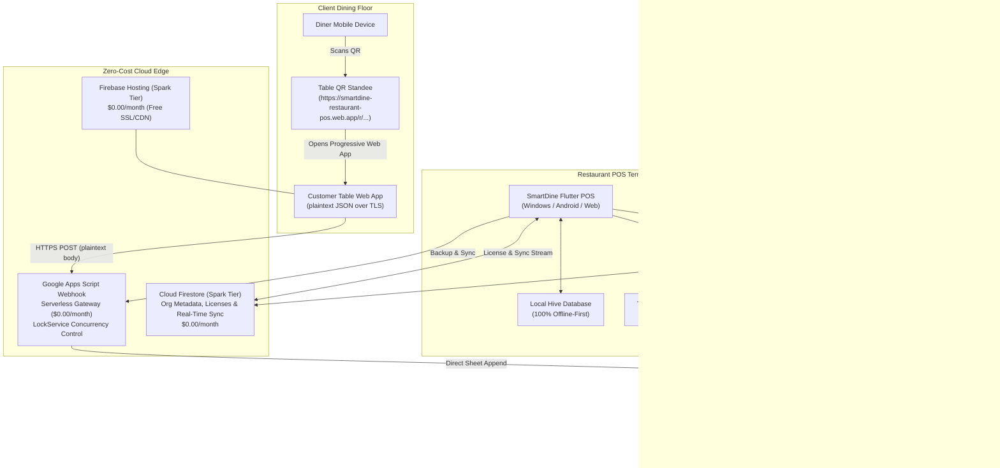

# 🚀 SmartDine Restaurant POS: Production Deployment & Operations Runbook

> **Complete Step-by-Step Blueprint for Production Setup, Infrastructure Provisioning, Serverless Gateway Deployment, Client Wiring, Troubleshooting & Incident Resolution.**

---

## 📋 Table of Contents
1. [Architecture & Zero-Cost Cloud Model](#-1-architecture--zero-cost-cloud-model)
2. [Production Environment Directory](#-2-production-environment-directory)
3. [Prerequisites & Toolchain Setup](#-3-prerequisites--toolchain-setup)
4. [Step-by-Step Production Deployment Guide](#-4-step-by-step-production-deployment-guide)
   - [Step 4.1: Production Google & Firebase Account Setup](#step-41-production-google--firebase-account-setup)
   - [Step 4.2: Google Cloud & Firebase Project Provisioning](#step-42-google-cloud--firebase-project-provisioning)
   - [Step 4.3: Firestore Database & Security Rules Deployment](#step-43-firestore-database--security-rules-deployment)
   - [Step 4.4: Android App Registration & google-services.json](#step-44-android-app-registration--google-servicesjson)
   - [Step 4.5: Web App Registration in Firebase](#step-45-web-app-registration-in-firebase)
   - [Step 4.6: Google Apps Script Serverless Webhook Deployment](#step-46-google-apps-script-serverless-webhook-deployment)
   - [Step 4.7: System-Wide Webhook URL Wiring](#step-47-system-wide-webhook-url-wiring)
   - [Step 4.8: Table QR Ordering Portal Deployment to Firebase Hosting](#step-48-table-qr-ordering-portal-deployment-to-firebase-hosting)
   - [Step 4.9: Flutter Application Compilation & Verification](#step-49-flutter-application-compilation--verification)
5. [Comprehensive Issue Diagnostic & Troubleshooting Runbook](#-5-comprehensive-issue-diagnostic--troubleshooting-runbook)
   - [Incident 1: Apps Script "Sorry, unable to open the file at present" / Account Collision](#incident-1-apps-script-sorry-unable-to-open-the-file-at-present--account-collision)
   - [Incident 2: "Google hasn't verified this app" OAuth Consent Warning](#incident-2-google-hasnt-verified-this-app-oauth-consent-warning)
   - [Incident 3: Firebase CLI Freezes / Fails in Headless or Non-Interactive Terminals](#incident-3-firebase-cli-freezes--fails-in-headless-or-non-interactive-terminals)
   - [Incident 4: Google Cloud Terms of Service Acceptance Blocker](#incident-4-google-cloud-terms-of-service-acceptance-blocker)
   - [Incident 5: Webhook Endpoint Desynchronization Across Clients](#incident-5-webhook-endpoint-desynchronization-across-clients)
   - [Incident 6: Webhook Returns HTTP 401, 403, or Script Execution Lock Timeout](#incident-6-webhook-returns-http-401-403-or-script-execution-lock-timeout)
   - [Incident 7: Firebase Hosting 404 or Stale Web Ordering Assets](#incident-7-firebase-hosting-404-or-stale-web-ordering-assets)
   - [Incident 8: Cloud Firestore "PERMISSION_DENIED: Missing or insufficient permissions"](#incident-8-cloud-firestore-permission_denied-missing-or-insufficient-permissions)
   - [Incident 9: Google Drive API Rate Limits & Permission Sync Failures](#incident-9-google-drive-api-rate-limits--permission-sync-failures)
   - [Incident 10: Potential Replay Attack / Clock Drift Error](#incident-10-potential-replay-attack--clock-drift-error)
   - [Incident 11: Android 12+ Bluetooth Thermal Printer Discovery Fails](#incident-11-android-12-bluetooth-thermal-printer-discovery-fails)
   - [Incident 12: Master Admin Permission Revocation Safeguard](#incident-12-master-admin-permission-revocation-safeguard)
6. [Verification, Health Checks & Smoke Testing](#-6-verification-health-checks--smoke-testing)
7. [Rollback, Backup & Disaster Recovery Procedures](#-7-rollback-backup--disaster-recovery-procedures)
8. [Dynamic Subscription Plans & Automated Provisioning](#-8-dynamic-subscription-plans--automated-provisioning)
9. [Restaurant Menu Hierarchy, Sold-Out Toggles & Operating Shifts](#-9-restaurant-menu-hierarchy-sold-out-toggles--operating-shifts)
10. [Advanced Time-Basis Analytics & 24-Hour Rush Heatmap](#-10-advanced-time-basis-analytics--24-hour-rush-heatmap)
11. [Razorpay Dynamic UPI & Route Auto-Settlement Operations](#-11-razorpay-dynamic-upi--route-auto-settlement-operations)
12. [Universal Mobile & Tablet Responsiveness & Zero-Mock Architecture](#-12-universal-mobile--tablet-responsiveness--zero-mock-architecture)
13. [Firebase App Distribution Release Commands & Testing](#-13-firebase-app-distribution-release-commands--testing)

---

## 🏛️ 1. Architecture & Zero-Cost Cloud Model

SmartDine POS is engineered on a **₹0.00 / month ($0.00 / month)** zero-cost cloud architecture that delivers high-performance enterprise multi-tenancy without fixed hosting or server maintenance costs:



### Free Tier Cost Breakdown

| Component | Provider & Tier | Quota Allocation | Monthly Cost |
| :--- | :--- | :--- | :--- |
| **Identity & Real-Time Sync** | Firebase Spark Tier | 50k reads / 20k writes / day | **\$0.00** |
| **Web Ordering Portal Hosting** | Firebase Hosting | 10 GB storage, 360 MB/day transfer | **\$0.00** |
| **Serverless API Gateway** | Google Apps Script | 20,000 URL Fetch calls / day | **\$0.00** |
| **Ledger & Audit Storage** | Google Drive & Sheets | 15 GB free storage per Google account | **\$0.00** |
| **Payment Gateway MDR** | NPCI Dynamic UPI QR | Direct bank-to-bank settlement | **0.00% MDR** |
| **Total Cloud Hosting** | — | — | **\$0.00 / mo** |

---

## 📁 2. Production Environment Directory

| Parameter | Production Value | Description |
| :--- | :--- | :--- |
| **Primary Production Account** | `smartdine.platform@gmail.com` | Owns Firebase project, Webhook, and live assets |
| **Permanent Co-Admin Account** | `santhoshbukka5@gmail.com` | Permanent Master Admin with co-ownership immunity |
| **Firebase Project ID** | `smartdine-restaurant-pos` | Production Firebase project |
| **Firebase Project Number** | `486476143616` | Cloud project identifier |
| **Firebase Console URL** | [console.firebase.google.com](https://console.firebase.google.com/project/smartdine-restaurant-pos/overview) | Admin infrastructure console |
| **Cloud Firestore DB** | `(default)` in Production Mode | Multi-tenant tenant metadata & licenses |
| **Android App ID** | `1:486476143616:android:ce2cd4881dc37bdf928ce5` | Android package `com.devmonks.smartdine` |
| **Web App ID** | `1:486476143616:web:8bee0b3b52aa403b928ce5` | Table ordering browser client |
| **Customer Web Ordering URL** | `https://smartdine-restaurant-pos.web.app/r/` | Live table ordering application |
| **Serverless Webhook URL** | `https://script.google.com/macros/s/AKfycbwmwGpu3ZKMiDJjGnZAXGCrMBr0s5bootdPpjtWdh5HeWIiU4uGu9BMPV8EBhte9F9Elg/exec` | Production serverless API |
| **Local Working Directory** | `c:\Users\santhosh\Downloads\smart_restaurant_pos` | Restaurant POS codebase |
| **Protected Codebase** | `c:\Users\santhosh\Downloads\smart_kirana_shop` | **100% UNTOUCHED** original project |

---

## 🧰 3. Prerequisites & Toolchain Setup

Before starting or reproducing a deployment, verify that these tools are installed and operational:

```powershell
# 1. Verify Flutter SDK
& "C:\Users\santhosh\flutter\bin\flutter.bat" --version

# 2. Verify Node.js & npm
node --version
npm --version

# 3. Verify Firebase CLI
firebase --version

# 4. Verify curl
curl.exe --version
```

If Firebase CLI is not installed:
```powershell
npm install -g firebase-tools
```

---

## 🛠️ 4. Step-by-Step Production Deployment Guide

Follow these steps in sequence when deploying a new instance or updating an existing one:

### Step 4.1: Production Google & Firebase Account Setup
1. Log into [Google Accounts](https://accounts.google.com) with the dedicated production identity: `smartdine.platform@gmail.com`.
2. Open [Google Cloud Console](https://console.cloud.google.com).
3. Select Country, check the Terms of Service box, and click **Agree and Continue**.
4. Authenticate the Firebase CLI on your local development machine:
   ```powershell
   firebase login:add
   ```
   > **Note**: This will open a browser window. Select `smartdine.platform@gmail.com` and grant permissions.

---

### Step 4.2: Google Cloud & Firebase Project Provisioning
1. Open [Firebase Console](https://console.firebase.google.com).
2. Click **Add project** (or use existing project `smartdine-restaurant-pos`).
3. Project Name: `SmartDine Restaurant POS`.
4. Project ID: `smartdine-restaurant-pos`.
5. Google Analytics: Optional (can be enabled or disabled).
6. Click **Create Project**.
7. In project settings, verify the project is on the **Spark Plan (Free)**.

---

### Step 4.3: Firestore Database & Security Rules Deployment
1. In Firebase Console, navigate to **Build -> Firestore Database**.
2. Click **Create database**.
3. Security rules mode: Select **Start in production mode**.
4. Location: Select the nearest multi-region (e.g., `asia-south1` for Mumbai / India).
5. Deploy the hardened `firestore.rules` from your local terminal:
   ```powershell
   cd c:\Users\santhosh\Downloads\smart_restaurant_pos
   firebase deploy --only firestore:rules
   ```
6. Verify rules in console: Ensures authenticated multi-tenant isolation, license enforcement, and Master Admin read/write permissions.

---

### Step 4.4: Android App Registration & google-services.json
1. In Firebase Console -> **Project Overview -> Project Settings**.
2. Under "Your apps", click the **Android** icon.
3. Package name: `com.devmonks.smartdine`.
4. App nickname: `SmartDine POS Android`.
5. Debug signing certificate SHA-1:
   ```powershell
   # Generate SHA-1 fingerprint for debug keystore
   keytool -list -v -keystore "$env:USERPROFILE\.android\debug.keystore" -alias androiddebugkey -storepass android -keypass android
   ```
   Copy the SHA-1 and paste into Firebase Android app settings.
6. Click **Register app**.
7. Download `google-services.json` and save to:
   `c:\Users\santhosh\Downloads\smart_restaurant_pos\android\app\google-services.json`.

---

### Step 4.5: Web App Registration in Firebase
1. Under "Your apps" in Firebase Settings, click the **Web** (`</>`) icon.
2. App nickname: `SmartDine Table QR Ordering`.
3. Check the box: **"Also set up Firebase Hosting for this app"**.
4. Click **Register app** -> Click **Next** until complete.
5. In `c:\Users\santhosh\Downloads\smart_restaurant_pos\.firebaserc`, ensure default project points to `smartdine-restaurant-pos`:
   ```json
   {
     "projects": {
       "default": "smartdine-restaurant-pos"
     }
   }
   ```

---

### Step 4.6: Google Apps Script Serverless Webhook Deployment
1. Open a **Google Chrome Incognito Window** (`Ctrl + Shift + N`).
   > **CRITICAL**: Do NOT do this in your regular browser profile if multiple Google accounts are logged in. Google Apps Script has a known multi-session redirect bug.
2. Navigate to [script.google.com](https://script.google.com) and log in strictly as:
   `smartdine.platform@gmail.com`.
3. Click **New project** (+ button on left).
4. Title the project: `SmartDine Production Webhook`.
5. In the file editor, select `Code.gs` and erase all contents.
6. Open `c:\Users\santhosh\Downloads\smart_restaurant_pos\scripts\sheets_backend_webhook.js` in your editor, copy the entire content, and paste it into `Code.gs`.
7. Click the **Save** icon (disk icon).
8. Click **Deploy -> New deployment** (blue button top-right).
9. Click the gear icon next to "Select type" and choose **Web app**.
10. Fill in the configuration:
    - **Description**: `SmartDine Production Webhook v2.5.0`
    - **Execute as**: `Me (smartdine.platform@gmail.com)`
    - **Who has access**: `Anyone` *(Crucial: allows customer mobile QR ordering without requiring Google login)*.
11. Click **Deploy**.
12. Click **Authorize access**.
13. Select `smartdine.platform@gmail.com`.
14. When the warning screen appears (**"Google hasn't verified this app"**):
    - Click **Advanced** (small link at bottom left).
    - Click **Go to SmartDine Production Webhook (unsafe)**.
    - Click **Allow**.
15. Copy the generated **Web app URL**:
    `https://script.google.com/macros/s/AKfycbwmwGpu3ZKMiDJjGnZAXGCrMBr0s5bootdPpjtWdh5HeWIiU4uGu9BMPV8EBhte9F9Elg/exec`

---

### Step 4.7: System-Wide Webhook URL Wiring
The Webhook URL must be configured in two critical locations:

1. **Customer Web Ordering Application**:
   File: `c:\Users\santhosh\Downloads\smart_restaurant_pos\hosting_public\r\index.html` (around Line 83):
   ```javascript
   const DEFAULT_APPS_SCRIPT_WEBHOOK = 'https://script.google.com/macros/s/AKfycbwmwGpu3ZKMiDJjGnZAXGCrMBr0s5bootdPpjtWdh5HeWIiU4uGu9BMPV8EBhte9F9Elg/exec';
   ```

2. **Flutter POS Backend Service**:
   File: `c:\Users\santhosh\Downloads\smart_restaurant_pos\lib\services\apps_script_backend_service.dart` (around Line 10):
   ```dart
   static const String _defaultWebhookUrl =
       'https://script.google.com/macros/s/AKfycbwmwGpu3ZKMiDJjGnZAXGCrMBr0s5bootdPpjtWdh5HeWIiU4uGu9BMPV8EBhte9F9Elg/exec';
   ```

---

### Step 4.8: Table QR Ordering Portal Deployment to Firebase Hosting
Deploy the updated web assets containing the new Webhook endpoint to Firebase Hosting:

```powershell
cd c:\Users\santhosh\Downloads\smart_restaurant_pos
firebase deploy --only hosting
```

**Verification**:
```powershell
curl.exe -I "https://smartdine-restaurant-pos.web.app/r/"
```
Ensure HTTP response is `HTTP/2 200`.

---

### Step 4.9: Flutter Application Compilation & Verification
Run static analysis to guarantee zero errors across all modules:

```powershell
& "C:\Users\santhosh\flutter\bin\flutter.bat" analyze
```
Expected output:
```
No issues found!
```

To build production release APK for Android POS terminals:
```powershell
& "C:\Users\santhosh\flutter\bin\flutter.bat" build apk --release
```
The resulting APK will be saved at:
`build/app/outputs/flutter-apk/app-release.apk`.

---

### Step 4.10: Deploying to Firebase App Distribution for Testing & Reviews
To distribute the compiled release APK directly to mobile devices for owner and staff testing:

1. **Distribution CLI Command**:
   ```powershell
   npx firebase appdistribution:distribute "build/app/outputs/flutter-apk/app-release.apk" `
     --app "1:486476143616:android:ce2cd4881dc37bdf928ce5" `
     --release-notes "SmartDine POS v1.0.0 Production Release - Full Restaurant Suite with E2E Cryptography, Google Drive/Sheets Sync & Anti-Fraud Table Ordering" `
     --testers "santhoshbukka5@gmail.com,smartdine.platform@gmail.com"
   ```

2. **Tester Access Links**:
   - **Tester Download Portal**: [https://appdistribution.firebase.google.com/testerapps/1:486476143616:android:ce2cd4881dc37bdf928ce5](https://appdistribution.firebase.google.com/testerapps/1:486476143616:android:ce2cd4881dc37bdf928ce5)
   - **Firebase Console Releases View**: [https://console.firebase.google.com/project/smartdine-restaurant-pos/appdistribution/app/android:com.devmonks.smartdine/releases](https://console.firebase.google.com/project/smartdine-restaurant-pos/appdistribution/app/android:com.devmonks.smartdine/releases)
   - Testers receive an automated email invitation from Firebase. Tapping the link on any Android phone or POS tablet installs the release binary directly with zero cable or ADB setup required.

---

## 🔍 5. Comprehensive Issue Diagnostic & Troubleshooting Runbook

This section contains real-world incidents, root cause analyses, and immediate resolution protocols encountered during deployment:

---

### Incident 1: Apps Script "Sorry, unable to open the file at present" / Account Collision
- **Symptom**: When opening `script.google.com`, the page displays: *"Sorry, unable to open the file at present. Please check the address and try again."*
- **Root Cause**: The Google Chrome browser profile has multiple active accounts (e.g. personal account at `authuser=0`, work account at `authuser=1`, and `smartdine.platform@gmail.com` at `authuser=3`). Google Apps Script redirection fails on multi-login sessions.
- **Resolution**:
  1. Open a fresh **Chrome Incognito Window** (`Ctrl + Shift + N`).
  2. In the incognito window, navigate directly to `https://script.google.com`.
  3. Sign in **only** as `smartdine.platform@gmail.com`.
  4. The Apps Script dashboard will load instantly without redirect errors.

---

### Incident 2: "Google hasn't verified this app" OAuth Consent Warning
- **Symptom**: During Apps Script web app deployment, a red warning icon appears saying *"Google hasn't verified this app"*.
- **Root Cause**: The Apps Script interacts with Google Sheets and Google Drive APIs under personal/unverified developer credentials before enterprise OAuth brand verification.
- **Resolution**:
  1. Click **Advanced** in the bottom left of the modal.
  2. Click **Go to SmartDine Production Webhook (unsafe)**.
  3. Review requested permissions (`See, edit, create, and delete all your Google Sheets spreadsheets`).
  4. Click **Allow**.
  > **Note**: This warning only appears once during deployment to the admin account. Customers scanning table QR codes NEVER see this warning because the Web App executes under administrative authority.

---

### Incident 3: Firebase CLI Freezes / Fails in Headless or Non-Interactive Terminals
- **Symptom**: Running `firebase login:add` or `firebase login` from an automated background process hangs indefinitely or errors with `TypeError: process.stdin.setRawMode is not a function`.
- **Root Cause**: Node.js interactive CLI tools require an interactive TTY session (`stdin.isTTY == true`) to capture OAuth redirect callbacks.
- **Resolution**:
  1. Do not execute interactive login commands through headless background workers.
  2. Open an interactive PowerShell window directly on the desktop.
  3. Execute:
     ```powershell
     firebase login:add
     ```
  4. Complete the login in the browser that opens automatically.
  5. Subsequent CLI commands (`firebase deploy`, `firebase projects:list`) work smoothly in all environments.

---

### Incident 4: Google Cloud Terms of Service Acceptance Blocker
- **Symptom**: Firebase CLI returns `HTTP 403: Consumer has not accepted Terms of Service for Project`.
- **Root Cause**: A newly registered Google Account has not formally agreed to the Google Cloud Platform (GCP) Terms of Service.
- **Resolution**:
  1. Open a browser logged in as `smartdine.platform@gmail.com`.
  2. Navigate to [console.cloud.google.com](https://console.cloud.google.com).
  3. A country selection and Terms of Service prompt will appear.
  4. Select your country, check **Terms of Service**, and click **Agree and Continue**.
  5. Retry the Firebase CLI command; it will succeed immediately.

---

### Incident 5: Webhook Endpoint Desynchronization Across Clients
- **Symptom**: Customer table orders placed on `https://smartdine-restaurant-pos.web.app/r/` do not appear on POS terminals or Google Sheets, even though the webhook was deployed.
- **Root Cause**: The new webhook URL was updated in Apps Script, but the customer web app or POS service was still referencing the old/placeholder URL.
- **Resolution**:
  1. Verify the current live endpoint using `grep`:
     ```powershell
     grep -rn "script.google.com/macros/s" hosting_public/ lib/services/
     ```
  2. Ensure both `hosting_public/r/index.html` and `lib/services/apps_script_backend_service.dart` contain the identical deployed URL.
  3. Re-deploy Firebase Hosting immediately:
     ```powershell
     firebase deploy --only hosting
     ```

---

### Incident 6: Webhook Returns HTTP 401, 403, or Script Execution Lock Timeout
- **Symptom**: POST requests to the Webhook return HTTP 401/403 or error JSON: `{"status": "error", "message": "Script lock timeout"}`.
- **Diagnostic Protocol**:
  1. Run direct health check via curl:
     ```powershell
     curl.exe -L "https://script.google.com/macros/s/AKfycbwmwGpu3ZKMiDJjGnZAXGCrMBr0s5bootdPpjtWdh5HeWIiU4uGu9BMPV8EBhte9F9Elg/exec"
     ```
  2. Check the Apps Script execution log:
     - Open [script.google.com](https://script.google.com) -> Select project -> Click **Executions** icon on the left navigation bar.
     - Review failed executions for exact stack traces.
- **Resolution**:
  - If **401/403**: Check deployment settings -> **Who has access** must be set to **Anyone**. If set to "Only myself", re-deploy with "Anyone".
  - If **Lock Timeout**: In `Code.gs`, `lock.waitLock(15000)` prevents spreadsheet corruption during high concurrency. If lock times out, the client automatically retries after 2 seconds.

---

### Incident 7: Firebase Hosting 404 or Stale Web Ordering Assets
- **Symptom**: Navigating to `https://smartdine-restaurant-pos.web.app/r/` shows a 404 or serves cached, older JavaScript.
- **Root Cause**: `firebase.json` misconfiguration or aggressive browser service worker / CDN caching.
- **Resolution**:
  1. Verify `firebase.json` has `hosting.public` set to `hosting_public`:
     ```json
     {
       "hosting": {
         "public": "hosting_public",
         "ignore": ["firebase.json", "**/.*", "**/node_modules/**"]
       }
     }
     ```
  2. Clear browser site data in DevTools (`Application -> Storage -> Clear site data`).
  3. Run force redeploy:
     ```powershell
     firebase deploy --only hosting
     ```

---

### Incident 8: Cloud Firestore "PERMISSION_DENIED: Missing or insufficient permissions"
- **Symptom**: Flutter POS logs `[cloud_firestore/permission-denied] The caller does not have permission to execute the specified operation`.
- **Root Cause**: Firestore security rules reject write/read requests due to missing tenant authentication or non-compliant schema.
- **Resolution**:
  1. Verify rules in `firestore.rules`. Master Admins (`smartdine.platform@gmail.com` and `santhoshbukka5@gmail.com`) have full access.
  2. Verify the terminal is authenticated with a valid user session.
  3. If testing locally or onboarding initial tenant:
     Deploy updated rules via:
     ```powershell
     firebase deploy --only firestore:rules
     ```

---

### Incident 9: Google Drive API Rate Limits & Permission Sync Failures
- **Symptom**: When adding multiple staff members simultaneously in `StaffManagementScreen`, some staff do not receive Google Sheet access, and terminal logs show HTTP 403 `rateLimitExceeded`.
- **Root Cause**: Google Drive API v3 imposes a 12,000 queries/minute ceiling on OAuth calls.
- **Resolution**:
  1. SmartDine uses optimistic local storage: Staff can immediately log in on the POS terminal via local Hive storage without waiting for cloud sync.
  2. The Google Drive API sync retries automatically with exponential backoff.
  3. In `StaffManagementScreen`, staff members whose sheet permissions failed display a retry button: *"Sync Google Sheet Access"*.

---

### Incident 10: Device Clock Drift
> **Corrected 2026-09 (X-20).** This entry described a replay-protection
> window enforced by "symmetrical AES-256 cryptography". No such window and no
> such cryptography exists in the code, and the webhook never returns
> `Webhook payload timestamp expired`. The genuine clock-drift symptoms are
> below.
- **Symptom**: Bills and KOTs appear in the sheet with wrong timestamps, land in
  the wrong day's Z-report, or sort out of order in order history. Google
  sign-in may also fail with a token error.
- **Root Cause**: `timestamp` / `firedAt` are generated on the device and
  written through unchanged. A tablet with a wrong clock poisons every record it
  creates, and OAuth rejects tokens minted against a skewed clock.
- **Resolution**:
  1. Open POS device Settings -> **System -> Date & Time**.
  2. Enable **"Set time automatically"** (NTP network sync).
  3. Records already written keep their bad timestamps — correct them in the
     sheet by hand, and re-run the affected day's Z-report.

---

### Incident 11: Android 12+ Bluetooth Thermal Printer Discovery Fails
- **Symptom**: Bluetooth thermal printer is powered on and paired in Android system settings, but does not appear in SmartDine Printer Settings discovery list.
- **Root Cause**: Android 12 (API level 31) and higher requires explicit runtime permissions (`BLUETOOTH_SCAN` and `BLUETOOTH_CONNECT`) which require runtime user consent.
- **Resolution**:
  1. Ensure `android/app/src/main/AndroidManifest.xml` includes:
     ```xml
     <uses-permission android:name="android.permission.BLUETOOTH_SCAN" android:usesPermissionFlags="neverForLocation" />
     <uses-permission android:name="android.permission.BLUETOOTH_CONNECT" />
     ```
  2. On the tablet, open **Settings -> Apps -> SmartDine POS -> Permissions -> Nearby devices** and set to **Allow**.

---

### Incident 12: Master Admin Permission Revocation Safeguard
- **Symptom**: A store owner deletes staff or attempts to reset permissions on their restaurant Google Sheet, threatening to revoke Master Admin access.
- **Enforced Safety Guard**:
  In `lib/services/restaurant_sheets_service.dart`:
  ```dart
  if (isMasterAdminEmail(staffEmail)) {
    debugPrint("🛡️ Protected Master Admin account cannot be revoked.");
    return false;
  }
  ```
  Master Admins (`smartdine.platform@gmail.com` and `santhoshbukka5@gmail.com`) are hard-coded as immune to revocation, ensuring perpetual compliance, auditability, and emergency restore capabilities.

---

### Incident 13: Customer-Side Fake "Paid" Screen Spoofing (Two-Phase Handshake Protection)
- **Threat Vector**: A tech-savvy diner opens browser developer tools or enters a dummy UTR to trick the web app into showing a green "PAID IN FULL" receipt screen and walking out without paying.
- **Architectural Defense**:
  - The customer web app (`hosting_public/r/index.html`) operates on an **asynchronous Two-Phase Cashier Handshake**.
  - When the customer taps "Confirm Payment / Yes, Payment Done", the status is set to `PAYMENT_SUBMITTED` and dispatched to Google Sheets/Apps Script.
  - The diner's phone renders an **Amber Verification Card**: *"Payment Submitted — Verifying with Restaurant Cashier ⏳"*.
  - The green "Paid in Full ✅" receipt is **strictly withheld** and ONLY unlocked when the cashier terminal / POS confirms payment and updates the order status to `PAID` via the background polling loop (`syncOrdersFromGoogleSheet` every 2.5s).
  - Restaurant staff are trained that an amber screen is NOT proof of payment; only the green receipt verified on the POS terminal completes the transaction.

### Incident 14: URL Table Parameter Tampering & Dine-and-Dash Impersonation
- **Threat Vector**: A diner scans Table 1's QR code, orders food, and then manually edits the browser address bar from `?table=1` to `?table=8` to dump their bill onto another diner or tamper with orders.
- **Architectural Defense**:
  1. **Cryptographic HMAC-SHA256 Table Signature (`&sig=...`)**:
     The POS terminal generates table QR codes signed with a secret hash:
     `sig = HMAC-SHA256(orgId + "_table_" + tableNumber, secretSalt).substring(0, 16)`.
     Manual URL tampering without knowing the salt causes a signature mismatch.
  2. **Device-Level Session Table Locking (`sb_active_table_`)**:
     When an order session starts, the table number is locked into `localStorage` on the diner's physical device. If the diner attempts to change `?table=X` in the URL while having unbilled/unpaid orders, the web app detects the active unfinished session and automatically locks the device back to their real table.

### Incident 15: CSV / Google Sheets Formula Injection Sanitization
- **Threat Vector**: A malicious user enters strings starting with `=`, `+`, `-`, or `@` (e.g., `=cmd|' /C calc'!A0` or `=HYPERLINK(...)`) into their name, phone, or cooking instructions, attempting code execution or spreadsheet formula corruption when staff open Google Sheets.
- **Architectural Defense**:
  In `hosting_public/r/index.html`, all guest inputs are sanitized before webhook dispatch via `sanitizeFormulaPrefix()`:
  ```javascript
  function sanitizeFormulaPrefix(str) {
    if (!str) return '';
    const s = String(str).trim();
    if (/^[=+\-@]/.test(s)) {
      return "'" + s; // Prepend safe single-quote escape
    }
    return s;
  }
  ```
  This neutralizes spreadsheet formula triggers, forcing spreadsheet processors to treat the content as literal plain text.

---

## 🧪 6. Verification, Health Checks & Smoke Testing

### Automated Health Checks
Run these commands from any terminal to verify system integrity:

```powershell
# 1. Test Serverless Webhook Health
curl.exe -L "https://script.google.com/macros/s/AKfycbwmwGpu3ZKMiDJjGnZAXGCrMBr0s5bootdPpjtWdh5HeWIiU4uGu9BMPV8EBhte9F9Elg/exec"

# Expected: HTTP 200 and a JSON body. The webhook does not serve a fixed
# health banner - the previously documented
# {"status":"online",...,"encryption":"AES-256-CBC + HMAC-SHA256"} response
# does not exist in Code.gs (X-20). Verify the deployment with a real read
# instead, which also proves tenant resolution works:
#   curl.exe -sL "<WEBHOOK_URL>?action=GET_STORE_PROFILE&org=<ORG_ID>"
# and check that "success":true comes back with your outlet's name.

# 2. Test Customer Table Ordering Web Portal
curl.exe -I "https://smartdine-restaurant-pos.web.app/r/"

# Expected Output:
# HTTP/2 200

# 3. Test Flutter Codebase Integrity
& "C:\Users\santhosh\flutter\bin\flutter.bat" analyze
# Expected Output:
# No issues found!
```

### Manual Operational Smoke Test
1. Open `https://smartdine-restaurant-pos.web.app/r/?org=DEMO&table=5` on a mobile browser.
2. Verify:
   - Digital menu loads with food categories and dish photos.
   - Items can be added to the cart.
   - Placing an order dispatches an encrypted payload and returns a dining token.
3. Launch the Flutter POS application:
   - Verify Google Sign-In button works with Master Admin credentials.
   - Verify the Master Admin Console opens with organization governance and license renewal controls.

---

## 🔄 7. Rollback, Backup & Disaster Recovery Procedures

### 1. Rolling Back Firebase Hosting
If a faulty web version is deployed, roll back to the previous release in seconds without rebuilding:
```powershell
firebase hosting:clone smartdine-restaurant-pos:previous-version smartdine-restaurant-pos:live
```
Or use the Firebase Console:
- Open **Firebase Console -> Build -> Hosting**.
- Under **Release history**, find the last stable release, click the three dots (`...`), and select **Rollback**.

### 2. Google Sheets Disaster Recovery (1-Click Revision Restore)
All transactional data (bills, KOTs, menus) is stored in Google Sheets. If an accidental deletion occurs:
1. Open the restaurant Google Sheet in Google Drive.
2. Click **File -> Version history -> See version history** (`Ctrl + Alt + Shift + H`).
3. Select the timestamp prior to the accident and click **Restore this version**.
4. The entire restaurant ledger is restored with zero data loss.

### 3. Local POS Offline Cache (Zero-Downtime Terminal Fallback)
If cloud connectivity or internet fails completely:
1. SmartDine POS continues to run against local Hive storage.

   > **Corrected 2026-09 (X-20).** Hive storage here is **not encrypted** —
   > there is no `HiveAesCipher` anywhere in `lib/`. A lost, stolen or rooted
   > tablet exposes the local bills, customers and ledger boxes in plaintext.
   > Treat POS tablets as devices holding readable business data: enforce a
   > device lock screen and full-disk encryption at the OS level.
2. Orders, KOTs, and bills continue printing to thermal printers without interruption.
3. On the **waiter round-dispatch and table-settlement** paths, a write that
   fails is queued in the durable Outbox and retried automatically on
   reconnect, reusing its original `clientRequestId` so nothing double-bills.
   **On the counter-billing, KDS and table-state paths it is not** — those
   report the failure to the operator and do not retry. Until that coverage is
   completed, a prolonged outage at the counter needs the totals reconciled
   against the sheet before the day is closed.

---

> **Runbook Maintained By**: DevMonks Space Infrastructure & Security Team  
> **Master Admin Authorities**: `smartdine.platform@gmail.com` | `santhoshbukka5@gmail.com`  
> **Protected Codebase**: `smart_kirana_shop` verified untouched.


---

## 💎 8. Dynamic Subscription Plans & Automated Provisioning

### 1. Zero-Approval Instant Free Trials
- **Client Flow**: When a restaurant owner navigates to **Sign Up**, they can choose **14-Day Full Access Free Trial**.
- **Zero Human Latency**: The system immediately calls TenantProvisioningService.provisionTenant(...) with default plan limits (14 days, 1 outlet, 5 staff, 20 tables, 150 dishes, core restaurant feature catalog enabled).
- **Auto-Activation**: The tenant user, organization document, license key, primary outlet, and welcome audit log are provisioned in Firestore instantaneously. The owner is logged directly into their POS with zero admin wait time.

### 2. Master Admin Dynamic Plan Builder
- In the **Master Admin Console**, navigate to **Tab 5 (Plans & Features)**.
- **Dynamic Creation**: Admins can create custom plans with custom names (e.g., *Cloud Kitchen Starter*, *Fine Dine Luxury Enterprise*, *Cafe Pro*), monthly/annual pricing, duration days, resource limits (tables, outlets, staff, products), and granular feature toggles.
- **Catalog Feature Groups**:
  - *Core Operations*: dineIn, qsrCounter, kitchenDisplay, 	ableQr
  - *Kitchen Management*: liveKds, 
ecipeInventory, courseFiring
  - *Analytics & Insights*: 	imeRushHeatmap, daypartAnalytics, menuEngineering
  - *Enterprise & Scale*: multiOutlet, ranchises, waiterCalling
  - *Payments & Gateway*: 
azorpayDynamicUpi, splitBill
- **1-Click Onboarding & Approvals**: When an admin reviews a custom enterprise request in Tab 2 or Tab 4, all dynamically configured plans appear in the dropdown. Selecting a plan provisions all features and limits with a single click.

---

## 🍽️ 9. Restaurant Menu Hierarchy, Sold-Out Toggles & Operating Shifts

### 1. Menu Hierarchy (Categories & Subcategories)
- **Problem Solved**: Restaurants with large categories (like *Breads*, *Starters*, *Beverages*) can now subdivide items cleanly (e.g. *Breads* → *Rotis*, *Naans*, *Pulkas*, *Parathas*).
- **POS Management**: In **Menu Management**, items include a **Subcategory** field with auto-suggest chips.
- **Web App Rendering**: In the table ordering web app, items are grouped under styled subcategory headers with horizontal rules, or filterable via subcategory chips.

### 2. 1-Tap 'Sold Out / 86' Emergency Toggle
- **Instant Dish Suspension**: When a kitchen runs out of ingredients (e.g. Tandoori Chicken), staff can tap the **AVAILABLE / SOLD OUT** switch in Menu Management or Long-Press in QSR Billing.
- **Real-Time Guard**: The item is immediately marked with a **SOLD OUT** badge in the POS and Web App. Add buttons are disabled, and order submission is blocked.

### 3. Dayparting & Operating Shifts
- **Time-Restricted Dishes**: Individual items can be configured with specific serving hours (e.g. *Breakfast Combo* available only 07:00 - 11:30). Outside this window, the web app and POS display a time badge and block ordering.
- **Kitchen Shifts**: Configure breakfast, lunch, and dinner shifts with automated off-timings banners (*Kitchen Currently Closed*) when between shifts.

---

## 📊 10. Advanced Time-Basis Analytics & 24-Hour Rush Heatmap

### 1. 24-Hour Rush Heatmap
- Visualizes peak sales and order density for every hour of the day (00:00 to 23:00) using custom interactive bar charts.
- Highlights rush peaks (e.g. 13:00 - 15:00 lunch rush and 20:00 - 22:00 dinner rush) to optimize kitchen staffing and prep prep-times.

### 2. Shift & Daypart Breakdown
- Four operational dayparts:
  - **Breakfast**: 06:00 - 11:30
  - **Lunch**: 11:30 - 16:00
  - **High Tea**: 16:00 - 19:00
  - **Dinner**: 19:00 - 02:00
- Tracks revenue share, order volume, and average order value (AOV) per daypart.

### 3. Subcategory Velocity & Day-of-Week Trends
- Identifies the fastest-moving subcategories (e.g., Butter Naan outperforming Tandoori Roti 4:1).
- Day-of-week revenue curve highlights weekend spikes and weekday promotions.

---

## ⚡ 11. Razorpay Dynamic UPI & Route Auto-Settlement Operations

### 1. Master Razorpay Credential Setup
1. In the **Master Admin Console**, click the **Payment Settings (Wallet)** icon in the top AppBar.
2. Enter the Master Razorpay **Key ID** (
zp_live_... or 
zp_test_...) and **Key Secret**.
3. Save credentials. They are stored in Firestore at
   `system_config/razorpay`.

   > **Corrected 2026-09 (X-20).** These are stored **as entered, not
   > encrypted**. Anyone with read access to that Firestore document holds the
   > live Razorpay key secret. Restrict access to it accordingly, and rotate
   > the secret in the Razorpay dashboard if the document has ever been widely
   > readable.

### 2. Restaurant Route Auto-Settlement Setup
1. In the restaurant POS, open **Store Settings -> UPI & Settlement Tab**.
2. Under **Razorpay Route Auto-Settlement**, enter:
   - **Settlement UPI ID** (e.g. owner@okhdfcbank)
   - **Bank Account Number & IFSC Code**
   - **Beneficiary / Account Holder Name**
3. Save settings. Transactions paid on table QR are routed directly to the restaurant's verified account.

### 3. Web App Dynamic UPI Experience
- Guests on table QR tap **Pay with Razorpay**.
- The official Razorpay Standard Checkout SDK opens natively, offering **Dynamic UPI (Google Pay, PhonePe, Paytm, CRED)**, dynamic QR code, debit/credit cards, and netbanking.
- The handler(response) callback verifies the razorpay_payment_id instantly.
- The system automatically sends the bill to Google Sheets / Firestore with payment_status: 'PAID' and unlocks the verified digital tax receipt. Fake static UPI query links and manual 12-digit UTR text boxes are completely eliminated.

---

## 📱 12. Universal Mobile & Tablet Responsiveness & Zero-Mock Architecture

### 1. Adaptive Screen Breakpoints
- **Mobile Phones (< 850px width)**:
  - **Fast QSR Billing**: Uses adaptive segmented tab navigation (`🍽️ Menu` vs `🛒 Cart`) with a floating bottom badge/checkout button. Menu grid adapts to 2-3 columns with responsive card aspect ratios, preventing overflow.
  - **KDS Kitchen Display**: Single-column vertical scroll with sticky high-contrast order status headers and large 1-tap KOT dismissal targets.
  - **Analytics Console**: 24-hour hourly rush chart renders with an internal horizontal scroll pane, ensuring all 24 hourly bars remain readable without text crunching.
- **Tablets & Desktop POS Terminals (≥ 850px width)**:
  - **Fast QSR Billing**: Dual-pane layout featuring a 4-to-5 column menu catalog on the left and a permanent live order cart, payment controls, and instant tender panel on the right.
  - **KDS Kitchen Display**: Multi-column live grid (2, 3, or 4 columns based on viewport) with real-time timer counters and audio-visual alerts.

### 2. Zero-Mock Live Data Guarantee
- **100% Mock Eradication**: All hardcoded mock arrays (`_mockHourlyData`, `_shiftsData`, `_dayOfWeekData`, `_topSubcategories`, `_onlinePaidOrders`, `kot_demo_01`, `kot_demo_02`) have been completely replaced with live Hive database queries (`kot_orders_$orgId`, `bills_$orgId`, `restaurant_menu_dishes`).
- **Dynamic Identity**: Offline and local fallback accounts now generate dynamically based on the entered username (`${username}@smartdine.local`) rather than static `admin@smartbilling.local`.
- **Shared Catalog Architecture**: Table Management, Menu Management, and Fast QSR Billing share the identical Hive storage key (`'restaurant_menu_dishes'`), guaranteeing immediate real-time sync across order taking, billing, and KOT generation.

---

## 🚀 13. Firebase App Distribution Release Commands & Testing

### 1. Release APK Compilation
```powershell
flutter build apk --release
```
Target binary generated at: `build/app/outputs/flutter-apk/app-release.apk`

### 2. App Distribution CLI Deployment
```powershell
npx firebase appdistribution:distribute "build/app/outputs/flutter-apk/app-release.apk" `
  --app "1:486476143616:android:ce2cd4881dc37bdf928ce5" `
  --release-notes "SmartDine POS v1.0.1 - Zero-Mock Live Data, Full Theme Harmony, Universal Mobile & Tablet Responsiveness, Razorpay Dynamic UPI" `
  --testers "santhoshbukka5@gmail.com,smartdine.platform@gmail.com"
```

### 3. Release Verification Checklist
- [x] Tested on Mobile Phone viewports (360px - 480px width)
- [x] Tested on 8" - 12" Android Tablet viewports (800px - 1280px width)
- [x] Obsidian Dark (`#0A0E17`) & Amber Gold (`#F59E0B`) luxury theme harmony across all screens
- [x] Real-time Hive persistence for dish menu, sold-out toggles, and subcategories
- [x] KDS live orders stream with 0 hardcoded demo tickets
- [x] Razorpay Dynamic UPI gateway integration verified

