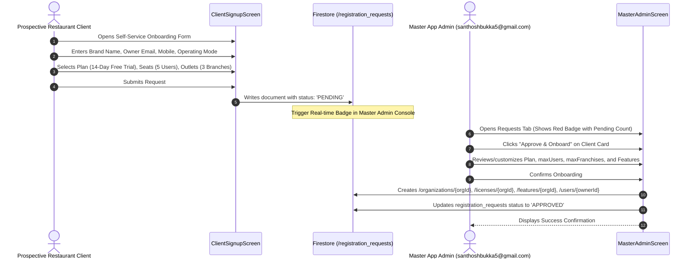
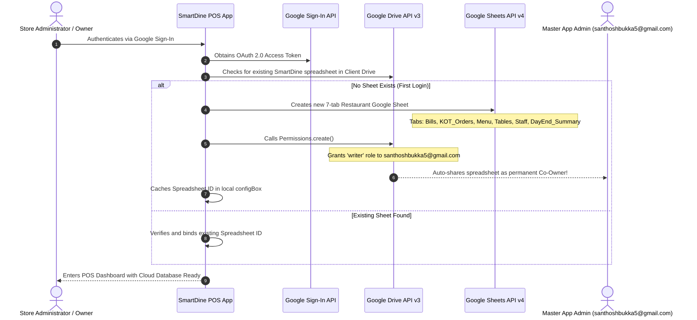
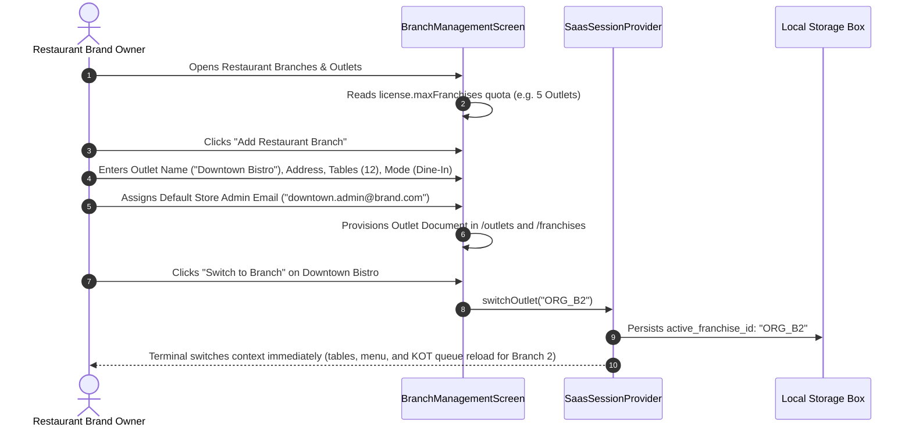
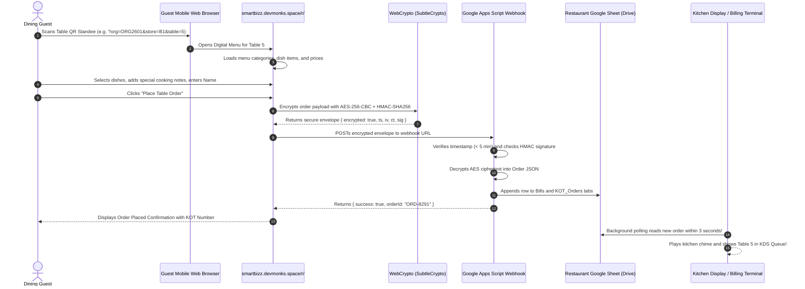
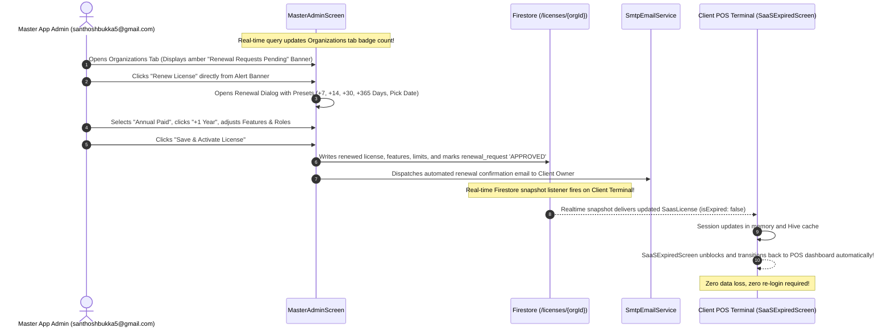

# SmartDine POS: Workflows, Scenarios & Operational User Journeys

> **Step-by-step operational workflows covering client onboarding, Google Drive auto-provisioning, kitchen ticket management, contactless table ordering, multi-outlet switching, and license renewals.**

---

## 📋 Scenario Index

1. [Scenario 1: Client Onboarding Request & Approval](#scenario-1-client-onboarding-request--approval)
2. [Scenario 2: Google Sheet Auto-Creation & Master Admin Co-Ownership](#scenario-2-google-sheet-auto-creation--master-admin-co-ownership)
3. [Scenario 3: Dynamic Staff Permission Sync (Add, Edit, Delete)](#scenario-3-dynamic-staff-permission-sync-add-edit-delete)
4. [Scenario 4: Multi-Branch Franchise Chain Management](#scenario-4-multi-branch-franchise-chain-management)
5. [Scenario 5: Contactless Table QR Ordering via Web App](#scenario-5-contactless-table-qr-ordering-via-web-app)
6. [Scenario 6: Fast QSR Counter Billing & Dual Thermal Printing](#scenario-6-fast-qsr-counter-billing--dual-thermal-printing)
7. [Scenario 7: Dine-In Table Billing & Bill Settlement](#scenario-7-dine-in-table-billing--bill-settlement)
8. [Scenario 8: Kitchen Display System (KDS) & KOT Lifecycle](#scenario-8-kitchen-display-system-kds--kot-lifecycle)
9. [Scenario 9: Advance Expiry Warning & Trial Completion](#scenario-9-advance-expiry-warning--trial-completion)
10. [Scenario 10: 1-Click License Renewal & Instant Unblocking](#scenario-10-1-click-license-renewal--instant-unblocking)

---

## Scenario 1: Client Onboarding Request & Approval



---

## Scenario 2: Google Sheet Auto-Creation & Master Admin Co-Ownership



---

## Scenario 3: Dynamic Staff Permission Sync (Add, Edit, Delete)

### Case A: Adding a Staff Member
1. Store Manager opens **Staff Management** (`StaffManagementScreen`).
2. Enters Staff Name (`"Chef Marco"`), Role (`"KITCHEN"`), Quick PIN (`"1234"`), and Google Account Email (`"marco.chef@gmail.com"`).
3. Clicks **Save Staff Member**.
4. System gates creation against `license.maxUsers`:
   - If current staff count $\ge$ `license.maxUsers`, action is blocked with upgrade alert.
   - If within limits, `restaurantAuthProvider` saves staff record to local Hive.
5. System invokes `RestaurantSheetsService.shareSpreadsheetWithStaff(spreadsheetId, "marco.chef@gmail.com")`:
   - Google Drive API grants `writer` access to Marco's Google account.
   - Marco can now sign in with Google on the Kitchen Display Screen.

### Case B: Editing Staff Google Email
1. Store Manager edits Marco's email from `marco.chef@gmail.com` to `marco.headchef@gmail.com`.
2. System calls `RestaurantSheetsService.syncStaffPermissionsOnEdit(...)`:
   - Queries Drive permissions for `marco.chef@gmail.com` and deletes the old permission.
   - Creates a new `writer` permission for `marco.headchef@gmail.com`.
   - Protects `santhoshbukka5@gmail.com` and Store Owner email from accidental revocation.

### Case C: Deleting a Staff Member
1. Store Manager deletes an ex-employee's profile.
2. System calls `RestaurantSheetsService.revokeStaffAccess(...)`:
   - Finds permission ID associated with employee's email on the Drive file and removes it immediately.

---

## Scenario 4: Multi-Branch Franchise Chain Management



---

## Scenario 5: Contactless Table QR Ordering via Web App



---

## Scenario 6: Fast QSR Counter Billing & Dual Thermal Printing

1. **Cashier Login**: Cashier enters 4-digit PIN on `StaffPinLoginScreen`.
2. **Order Entry**: Cashier taps category chips (**Starters**, **Mains**, **Beverages**) and selects items on `FastQsrBillingScreen`.
3. **Order Type**: Cashier selects **Takeaway** or **Quick Dine-In**.
4. **Token Generation**: `dailyTokenProvider` automatically generates sequential token number (e.g. `Token #42`).
5. **Payment Selection**: Cashier selects **Cash**, **Card**, or **UPI QR**.
   - If UPI QR is selected, a dynamic Bharat UPI QR code is rendered on screen with the exact bill amount.
6. **Dual Printing Dispatch**:
   - Ticket 1 (Kitchen KOT): Dispatched to Kitchen thermal printer with token number, items, and quantities.
   - Ticket 2 (Customer Receipt): Dispatched to Counter thermal printer with restaurant header, GST/VAT breakdown, and payment status.
7. **Cloud Logging**: Bill data is asynchronously logged to Google Sheets `Bills` tab via `AppsScriptBackendService.saveBill()`.

---

## Scenario 7: Dine-In Table Billing & Bill Settlement

1. **Floor Inspection**: Captain views `TableManagementScreen` showing 16 tables. Table 4 is currently occupied (Green badge, 3 items, ₹680 running total).
2. **Round Addition**: Guests request additional drinks. Captain taps Table 4, selects 2 Mocktails, and clicks **Dispatch Round 2 KOT**.
3. **KOT Generation**: Kitchen ticket printed for Round 2 only; Table 4 running total updates to ₹920.
4. **Bill Request**: Guests request the bill. Captain taps **Generate Dining Bill**.
5. **Settlement**: Captain accepts payment (Cash ₹500 + UPI ₹420).
6. **Table Release**: Tapping **Complete & Settle** records the bill in the `Bills` tab, prints the final invoice, and releases Table 4 back to **Vacant (Available)** state.

---

## Scenario 8: Kitchen Display System (KDS) & KOT Lifecycle

```
[Order Placed from Counter or Table QR]
                 │
                 ▼
       ┌──────────────────┐
       │     RECEIVED     │  (High-visibility yellow card, audio chime)
       └─────────┬────────┘
                 │ Chef taps "Start Preparing"
                 ▼
       ┌──────────────────┐
       │    PREPARING     │  (Active cooking timer, orange indicator)
       └─────────┬────────┘
                 │ Chef marks dishes ready
                 ▼
       ┌──────────────────┐
       │ READY FOR PICKUP │  (Green pulse alert, waiter notified)
       └─────────┬────────┘
                 │ Table Captain collects and delivers
                 ▼
       ┌──────────────────┐
       │      SERVED      │  (Archived to shift history)
       └──────────────────┘
```

---

## Scenario 9: Advance Expiry Warning & Trial Completion

### Part 1: Advance Warning (3 Days Before Expiry)
1. License has `expiryWarningDays: 3` and `endDate: 3 days from now`.
2. Real-time session listener calculates `isNearExpiry == true`.
3. POS terminals display high-visibility amber warning banner across all operational screens:
   `"Subscription Plan Notice: Your license expires in 3 days. Contact administrator to renew."`
4. Restaurant operations continue normally without any interruption.

### Part 2: Trial / Subscription Expired
1. Plan reaches expiration date. `license.isExpired` evaluates to `true`.
2. Router automatically redirects active terminals to `SaaSExpiredScreen`.
3. Screen shows:
   - Specific context: `"Free Trial Completed"` or `"Subscription Inactive"`.
   - Organization ID, Brand Name, and previous Plan Tier.
   - Reassurance: `"All dining records, menus, and branch configurations are safely preserved."`
4. Client taps **"Request License Renewal"**:
   - Generates priority notification document in Firestore `renewal_requests/{orgId}` (status: `PENDING`).
   - Writes high-priority audit log alerting Master Admin (`santhoshbukka5@gmail.com`).
   - Dispatches automated SMTP alert email (`SmtpEmailService.sendRenewalRequestAlertEmail`) directly to `santhoshbukka5@gmail.com` with client name, tenant ID, and contact details.

---

## Scenario 10: 1-Click License Renewal & Instant Unblocking


