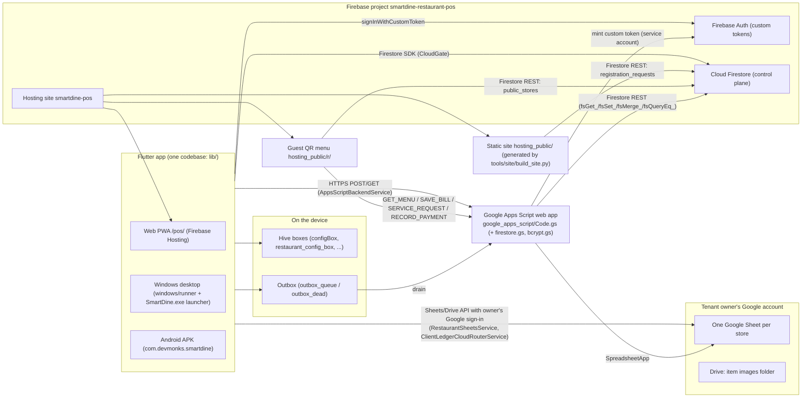
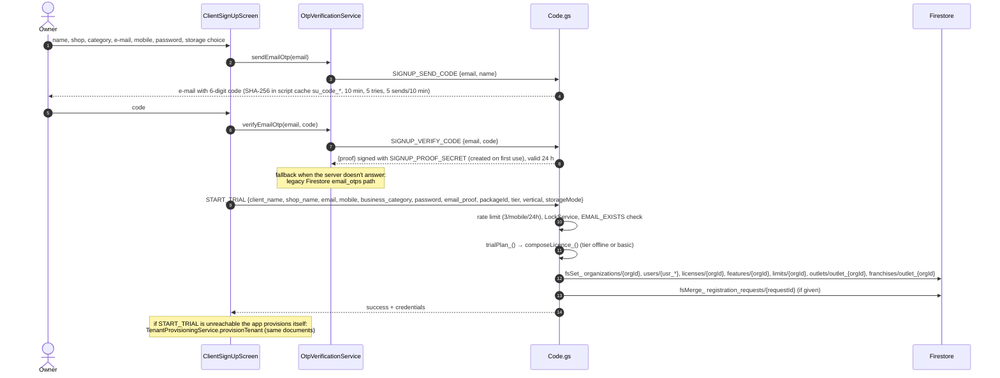
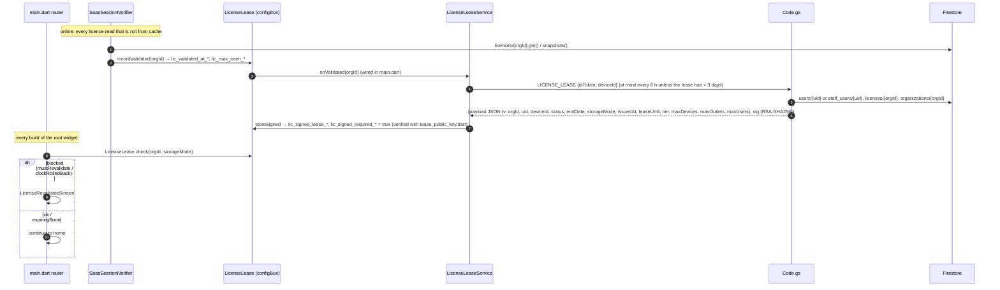
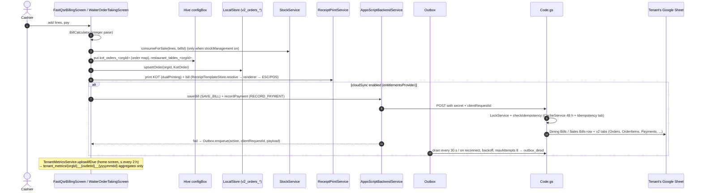
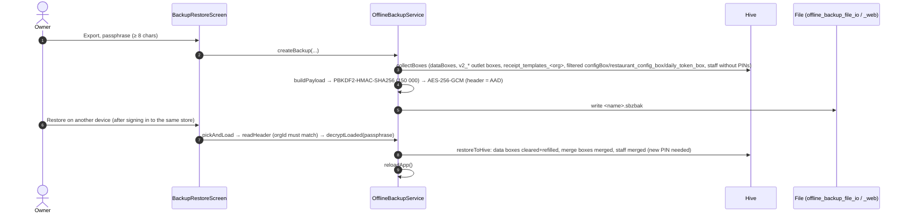

# 02 — System architecture

Audience: a developer or coding agent who has to change something without reading the whole repo.
Scope: components, deployment, the main request flows, state, storage modes, entitlements and tenancy.
Every name below was checked against the code at HEAD `526cfba`. Where the older docs
(`ARCHITECTURE.md`, `CONTEXT.md`) disagree with the code, this file follows the code.

Related: [`PLATFORM_STRUCTURE.md`](PLATFORM_STRUCTURE.md) (the product contract: trade × tier, plans,
add-ons, licence, wording), [`03_DATA_MODEL.md`](03_DATA_MODEL.md), [`04_CODE_MAP.md`](04_CODE_MAP.md),
[`GLOSSARY.md`](GLOSSARY.md), [`../SECURITY_NOTES.md`](../SECURITY_NOTES.md).

---

## 1. Components (high level)



| Component | Where | Role |
|---|---|---|
| Flutter app | `lib/` (entry `lib/main.dart`, root widget `SmartBizzApp`) | The till, the tenant back office and the platform admin console (`MasterAdminScreen`), one binary. |
| Hive | on each device, opened in `main()` (`configBox`, `deviceBox`, `restaurant_auth_box`, `restaurant_config_box`, `expenses`) plus boxes opened on demand | Operational data (bills, orders, catalogue, tables, khata, stock), session cache, settings. See `03_DATA_MODEL.md` §3. |
| Firebase Auth | project `smartdine-restaurant-pos` | Only custom tokens minted by Code.gs (`ISSUE_AUTH_TOKEN`); claims `orgId`, `role`, `franchiseId`, `adminVerified`. The app's password check is still bcrypt against Firestore when the server can't answer. |
| Cloud Firestore | same project | Control plane: organisations, licences, users, packages, plans, outlets, audit, leads, `public_stores`, `tenant_metrics`. Rules today are open (`firestore.rules`); the locked draft is `firestore.rules.next`. |
| Firebase RTDB | `main.dart` sets `databaseURL` to the `smart-kirana-shop-5bb2b` RTDB | Only `utils/license_helper.dart` (legacy trial record path) uses it. |
| Apps Script | `google_apps_script/Code.gs` (6 224 lines), `firestore.gs` (Firestore REST client, `FS_PROJECT`, `FS_USE_OAUTH`), `bcrypt.gs` | Single writer to the Sheets ledger; server side of sign-up, trials, custom tokens, signed leases, mail. Actions in §2. |
| Client's own Google Sheets / Drive | tenant owner's Drive | One sheet per store (`RestaurantSheetsService.provisionRestaurantSheet`), layout per trade (`SheetLayout`, twin `sheetLayoutFor_` in Code.gs). Item photos in `SmartDine_Menu_Images` (restaurant) / `SmartBizz_Product_Images` (shops). |
| Static site | `hosting_public/` (index, `restaurants/`, `kirana/`, `supermarket/`, `pharmacy/`, `retail/`, `register/`, legal pages) | Generated by `tools/site/build_site.py` from `site_data.py` + `screens.py` + `partials/`. Do not hand-edit the HTML. |
| Guest QR menu | `hosting_public/r/index.html` (+ `sw.js`) | Reads `public_stores/{orgId}` over Firestore REST, orders via Code.gs public actions. |
| Desktop launcher | `windows/desktop_launcher/Program.cs` → `SmartDine.exe`, `releases/SmartDine-Desktop.exe` | Local HTTP server + Edge/Chrome `--app` window around the web build (see CONTEXT.md §13). |

### 1.1 Apps Script actions (`doPost` switch in Code.gs, line ~86)

Authentication gate (Code.gs `doPost`, lines 55–83): `json.__authenticated = (json.secret === SECRET_TOKEN)`.
Only the actions in `isPublicAction` run without the secret: `START_TRIAL`/`REGISTER_TRIAL`, `SUBMIT_INQUIRY`,
`SEND_WHATSAPP_NOTIFICATION`/`WHATSAPP_NOTIFICATION`, `SAVE_BILL` when not settled, `RECORD_PAYMENT`,
`SERVICE_REQUEST`/`CALL_WAITER`, `DISMISS_SERVICE_REQUEST`/`RESOLVE_WAITER_CALL`. Everything else returns
`UNAUTHORIZED` without the secret (see the caveat in §3.2).

| Group | Actions → handler |
|---|---|
| Tenancy / provisioning | `ONBOARD_ORGANIZATION` → `handleOnboardOrganization`; `CREATE_OUTLET` → `handleCreateOutlet`; `REGISTER_TENANT` → `handleRegisterTenant` (Script property `org_<orgId>` → spreadsheet id); `START_TRIAL`/`REGISTER_TRIAL` → `handleStartTrial` (uses `trialPlan_`, `composeLicence_`) |
| Identity | `ISSUE_AUTH_TOKEN` → `handleIssueAuthToken_` (bcrypt check, admin 2nd step `checkAdminSecondStep_`, `mintFirebaseCustomToken_`); `LICENSE_LEASE` → `handleLicenseLease_` (RSA-signed lease); `SIGNUP_SEND_CODE` / `SIGNUP_VERIFY_CODE` → `handleSignupSendCode_` / `handleSignupVerifyCode_` (returns a signed `proof`, sent back as `email_proof` on `START_TRIAL`) |
| Mail | `SEND_OTP_EMAIL` → `handleSendOtpEmail`; `SEND_EMAIL`, `SEND_REGISTRATION_EMAIL`, `SEND_APPROVAL_EMAIL`, `SEND_REJECTION_EMAIL` → `handleSendEmail` (rate caps `mailRateLimited_`, optional sign-in `mailCallerRefused_`) |
| Orders & bills | `SAVE_BILL`/`UPDATE_ORDER_STATUS`/`UPDATE_STATUS` → `handleSaveBill`; `VOID_ORDER`/`CANCEL_ORDER` → `handleVoidOrder`; `VOID_LINE`/`CANCEL_LINE` → `handleVoidLine`; `RECORD_PAYMENT` → `handleRecordPayment`; `REFUND_PAYMENT` → `handleRefundPayment`; `CLOSE_DAY` → `handleCloseDay`; `CLOSE_SESSION` → `handleCloseSession`; `GET_DELTA`/`FETCH_DELTA` → `handleGetDelta`; `MIGRATE_V2_DATA` → `migrateDiningBillsToV2`; `PURGE_TEST_ORDERS` |
| Tables | `SET_TABLE_STATUS`, `RESERVE_TABLE`, `CANCEL_RESERVATION`, `SEAT_RESERVATION`, `MOVE_TABLE`, `MERGE_TABLES`, `CLEAR_TABLE`/`RESET_TABLE` |
| Catalogue / stock | `SYNC_INVENTORY` → `handleSyncInventory` (shops: `syncShopInventory_`); `TOGGLE_ITEM_AVAILABILITY`/`SET_ITEM_AVAILABILITY`; `DECREMENT_INVENTORY` |
| Guest service | `SERVICE_REQUEST`/`CALL_WAITER`, `DISMISS_SERVICE_REQUEST`/`RESOLVE_WAITER_CALL` |
| Misc | `LOG_AUDIT`, `FETCH_MASTER_ANALYTICS`, `SEND_WHATSAPP_NOTIFICATION` |

`doGet` (line 1639): `REGISTER_TENANT`, `GET_DELTA`/`FETCH_DELTA`, `GET_STORE_PROFILE`, `RESOLVE_SLUG`,
`GET_MENU`/`FETCH_MENU`, `GET_ORDERS`/`FETCH_ORDERS`.

Script property keys read by Code.gs (values are secrets — never copy them): `FIREBASE_SA_EMAIL`,
`FIREBASE_SA_PRIVATE_KEY`, `FIREBASE_WEB_API_KEY`, `LEASE_SIGNING_KEY`, `SIGNUP_PROOF_SECRET`,
`MAIL_REQUIRES_SIGN_IN`, `WHATSAPP_GATEWAY_URL`, `WHATSAPP_API_TOKEN`/`WHATSAPP_TOKEN`, `TENANT_REGISTRY`,
`admin_email`, and per-tenant/per-order keys `org_<orgId>`, `rev_*`, `menu_rev_*`, `recent_orders_*`,
`settled_orders_*`, `table_settled_*`.

App side: every POST goes through `AppsScriptBackendService.postWithRedirects` (follows the 302 echo,
converts `application/json` to `text/plain` on web, throws `CloudOfflineException` when `CloudGate.offline`
unless `licenceTraffic: true`). The webhook URL is `AppsScriptBackendService.getWebhookUrl()` (built-in
default, overridable from the admin console's webhook dialog, `setWebhookUrl`).

---

## 2. Deployment topology

| Item | Value (from `firebase.json`, `.firebaserc`, `lib/main.dart`, `lib/core/constants.dart`) |
|---|---|
| Firebase project | `smartdine-restaurant-pos` (`.firebaserc` default and production; `FirebaseOptions.projectId` in `main.dart`; `FS_PROJECT` in `firestore.gs`) |
| Hosting site | `smartdine-pos` → `https://smartdine-pos.web.app/` (custom domain `smartbizz.devmonks.space` maps to the same site) |
| Hosting root | `hosting_public/` |
| Rewrites | `/pos`, `/pos/**` → `/pos/index.html`; `/r`, `/r/**`, `/m`, `/m/**` → `/r/index.html` |
| No-cache headers | `/pos` and `/pos/{index.html, flutter_bootstrap.js, flutter_service_worker.js, version.json, main.dart.js, flutter.js, manifest.json}` |
| Web build | `flutter build web --release --base-href /pos/` then copy `build/web` → `hosting_public/pos` (`claude_run.ps1` uses `robocopy ... /E`) |
| Service-worker reload | `web/index.html`: on `controllerchange` (only if a controller existed before) the page reloads once, guarded by `sessionStorage['sb_sw_reloaded']`, so a deploy is picked up without closing the tab |
| Guest QR base URL | `kRestaurantWebOrderingBaseUrl = 'https://smartdine-pos.web.app/r/'` (`lib/core/constants.dart`) |
| Forced update | `app_versions` Firestore doc read by `appVersionProvider` (`main.dart`); compared with `kCurrentAppVersion = '1.2.0'` → `AppUpdateRequiredScreen` when mandatory |
| Apps Script | pasted by hand; redeploy as a **new version of the existing deployment** (URL must not change) — `google_apps_script/DEPLOY.md` |
| Rules | `firebase deploy --only firestore:rules` deploys `firestore.rules`; `firestore.rules.next` is the locked draft (checklist in SECURITY_NOTES.md) |
| One-shot check/deploy | `claude_run.ps1` (`-NoDeploy`: pub get, analyze, test; otherwise also web build, copy, `firebase deploy --only hosting`) |

`firebase.json` also names `"functions": {"source": "functions"}`, but there is no `functions/` directory;
nothing is deployed there.

---

## 3. Request flows

### 3.1 Sign-up and free trial (`ClientSignUpScreen` → Code.gs)



Paid tiers and Enterprise do not create a tenant: they write `registration_requests/{auto}` (with
`requestedPackageId`, `requestedPlanId`, `isEnterprise`, `emailProof`) for the admin to approve
(`AdminInquiriesView` / `RegistrationRequestsTab` → `TenantProvisioningService.provisionTenant`).
The marketing page `hosting_public/register/index.html` only writes `registration_requests` over Firestore REST.

### 3.2 Login (tenant and platform admin) — `SaasSessionNotifier.login`

```mermaid
sequenceDiagram
  autonumber
  actor U as User
  participant L as SaaSLoginScreen
  participant S as SaasSessionNotifier.login
  participant B as FirebaseAuthBridge
  participant GAS as Code.gs
  participant FA as Firebase Auth
  participant FS as Firestore
  U->>L: username/e-mail + password
  L->>S: login(id, pw)
  S->>B: signInForLogin(identifier, password)
  B->>GAS: ISSUE_AUTH_TOKEN {identifier, password [, mfaCode]}
  GAS->>FS: fsQueryEq_ users/staff_users by username|email
  alt platform admin, no code yet
    GAS-->>B: MFA_REQUIRED {email} (code e-mailed; SHA-256 in cache, 10 min, 5 tries)
    B-->>S: mfaRequired
    S-->>L: "MFA_REQUIRED:<email>"
    U->>L: 6-digit code
    L->>S: login(id, pw, mfaCode)
    S->>B: signInForLogin(..., mfaCode)
    B->>GAS: ISSUE_AUTH_TOKEN {+ mfaCode}
  end
  GAS-->>B: {token, claims{orgId, role, franchiseId, adminVerified?}}
  B->>FA: signInWithCustomToken(token)
  S->>FS: users → organizations → licenses (records LicenseLease.recordValidated on a server read)
  S->>S: Entitlements.fromLicense → offline owner-only rule, device cap
  S->>FS: device_registry/{deviceUuid} (DEVICE_LIMIT:orgId:count:cap if over cap)
  S->>S: cache to configBox (saas_user, saas_org, saas_license, saas_password_hash_*)
  S->>S: _setupRealtimeListeners(orgId)
```

Outcomes of `ServerLoginStatus`: `ok` → continue; `rejected` (`INVALID`/`RATE_LIMITED`) → final "wrong
password"; `mfaRequired` / `mfaFailed` → admin second step; `unavailable` → the app checks the bcrypt hash
itself (Firestore `users` → `staff_users`), and for the admin runs the client-side 2FA fallback
(`PlatformSecurityService.is2faEnabled` on `system_config/security`, code via
`OtpVerificationService.sendMfaLoginOtp`). With no network at all `_attemptOfflineLogin` checks the cached
hash (`saas_password_hash_*`); the platform admin is refused offline.

> **Caveat found while writing this (verify on the deployed script).** `FirebaseAuthBridge`,
> `LicenseLeaseService` and `OtpVerificationService._server` post `ISSUE_AUTH_TOKEN`, `LICENSE_LEASE`,
> `SIGNUP_SEND_CODE` and `SIGNUP_VERIFY_CODE` **without** the `secret` field, and none of these actions is in
> Code.gs `isPublicAction`. With the Code.gs in this repo they get `UNAUTHORIZED`, which the app treats as
> "server unavailable" and silently falls back (client-side bcrypt, client-side admin 2FA, Firestore
> `email_otps`, unsigned lease). Either add them to `isPublicAction` (they carry their own proof: password,
> ID token, e-mail code) or send the secret.

### 3.3 Licence at run time and the signed lease (online / offline)



Grace: `LicenseLease.offlineGraceDays = 30` for `PURE_OFFLINE`, `cloudGraceDays = 7` otherwise; warning
`LeaseCheck.warnDays = 5`. Once a device holds a signed lease (`lic_signed_required_<orgId>`), only a valid
signed lease counts. A connectivity listener (`_leaseConnSub` in `_setupRealtimeListeners`) calls
`refreshSessionFromFirestore()` when the device comes online.

Root routing order in `SmartBizzApp.build` (`main.dart` ~line 237): splash → `SaaSLoginScreen` (no user) →
`SaaSExpiredScreen` (licence inactive) → `LicenseRevalidateScreen` (lease blocked) → `MasterAdminScreen`
(role `MASTER_ADMIN`) → `FirstLoginPasswordScreen` (`mustChangePassword`) → `TenantLockedScreen`
(`organization.isLocked`) → `StorageMigrationGateScreen` (`hasPendingStorageChange`) → `RestaurantHomeScreen`.

### 3.4 Billing → Hive → outbox → Sheets / Firestore



Notes that matter when changing billing:

* `FastQsrBillingScreen` is the counter for every trade; `BarcodeBillingScreen` is the shop scan-first till
  opened from the single Billing card when `barcodeBilling` is on (`RestaurantHomeScreen._billingScreenFor`).
* `BarcodeBillingScreen._completeSale` writes the bill only to `configBox['kot_orders_<orgId>']` and khata to
  `configBox['customer_khata_<orgId>']`; it makes no webhook or Sheets call.
  `ClientLedgerCloudRouterService.postBillToRouter/postKhataToRouter` exist but have no callers.
* Guest QR orders are written by the guest page straight to Code.gs; KDS/waiter tablets see them via
  `AppsScriptBackendService.pollOrders` (`GET_ORDERS`).
* `SyncEngine` (`lib/sync/sync_engine.dart`) is not referenced outside its own file.
* Menu/catalogue: the item form saves to `restaurant_config_box['restaurant_menu_dishes']`, mirrors a public
  copy (private keys stripped) to `public_stores/{orgId}.menu_items`, and syncs the Sheet with
  `RestaurantSheetsService.syncMenuDishes` using the owner's Google sign-in.

### 3.5 Feature Matrix ↔ licence live sync

```mermaid
sequenceDiagram
  autonumber
  actor A as Platform admin
  participant FM as AdminFeaturesView (Feature Matrix)
  participant TD as TenantAccessDialog + TenantPackageEditor
  participant FS as Firestore licenses/{orgId}
  participant App as Tenant device (SaasSessionNotifier listener)
  FM->>FS: snapshots() on licenses/{orgId} and organizations/{orgId}
  TD->>FS: snapshots() on licenses/{orgId}
  A->>FM: toggle add-on / switch feature off
  FM->>FM: LicenceEdits.read → finish → licenceFields
  FM->>FS: batch.set licenses/{orgId} (merge) + features/{orgId} mirror + public_stores/{orgId} flags + audit_logs
  FS-->>TD: snapshot → if no unsaved edits: reload; else banner "This licence changed — Reload"
  FS-->>App: licence listener → state.currentLicense → entitlementsProvider rebuilds → UI and CloudGate follow
```

Neither editor writes a package or another client. Applying a changed package to all its tenants is
`PackageService.applyToTenants` (Packages view, confirmed), which keeps `addOns`/`featuresOff` and raises a
storage-family change as `pendingStorageChange` rather than flipping it.

### 3.6 Offline backup / restore (`OfflineBackupService`, Settings → Backup & restore)



Format and exclusions: `03_DATA_MODEL.md` §6.

---

## 4. State management (Riverpod 3, `flutter_riverpod`)

| Provider | File | Type → state | Notes |
|---|---|---|---|
| `saasSessionProvider` | `providers/saas_session_provider.dart` | `StateNotifierProvider<SaasSessionNotifier, SaasSessionState>` | The session: `currentUser` (`SaasUser`), `currentOrganization` (`SaasOrganization`), `currentLicense` (`SaasLicense`), `activeFranchiseId`, `savedUsers`, `isInitializing`, `isMockMode`; getter `vertical`. Owns login, logout, store switching, realtime listeners (org, user, licence, legacy features), audit logging. |
| `currentVerticalProvider` | same | `Provider<String>` | `saasSessionProvider.vertical` (organisation first, then user's category, then licence). |
| `entitlementsProvider` | `providers/entitlements_provider.dart` | `Provider<Entitlements>` | `Entitlements.fromLicense(license, isMasterAdmin, storageMode: org.storageMode, vertical, alignStarterToVertical: true)`. Side effects: `CloudGate.setOffline(...)` and `SheetLayout.setActiveVertical(...)`. |
| `featureEnabledProvider` | same | `Provider.family<bool, String>` | `entitlements.isEnabled(key)`. |
| `maxDevicesProvider`, `isPureOfflineProvider` | same | `Provider<int>`, `Provider<bool>` | |
| `dashboardLayoutProvider` | `providers/dashboard_layout_provider.dart` | `StateNotifierProvider.family<DashboardLayoutNotifier, DashboardLayoutState, String>` (by vertical) | Card ids `counter_billing, tables, orders_history, kds, menu, outlets, staff, store_config, analytics, expenses, waiter, customer_khata, stock` (`kAllDashboardCards`); saved in `configBox` under `<vertical>_primary_cards_v1`, `_dropdown_cards_v1`, `_hidden_cards_v1`. `DashboardCardMeta.isAllowedFor` fails closed on feature and role. |
| `restaurantAuthProvider` | `providers/restaurant_auth_provider.dart` | `StateNotifierProvider<RestaurantAuthNotifier, RestaurantAuthState>` | Station staff roster (`restaurant_auth_box['staff_members']`), active staff member, `OperatingMode`. |
| `authProvider`, `adminLoginChoiceProvider`, `isActivatedProvider`, `isRegisteredProvider`, `isClockTamperedProvider`, `authCheckingProvider`, `activeSessionSelectedProvider` | `providers/auth_provider.dart` | legacy shop-account state | `ShopAccount`; `authCheckingProvider` gates the splash. |
| `dailyTokenProvider` | `providers/daily_token_provider.dart` | `StateNotifierProvider<DailyTokenNotifier, DailyTokenState>` | Token numbers per org + counter code (`daily_token_box`), pattern `TokenPattern`. |
| `expensesProvider` | `providers/expenses_provider.dart` | `StateNotifierProvider<ExpensesNotifier, List<Map>>` | Hive `expenses` box; Firestore `expenses` when connected. |
| `thermalPrinterProvider` | `services/thermal_printer_service.dart` | `StateNotifierProvider<ThermalPrinterNotifier, PrinterState>` | Bluetooth printer + legacy layout switches (migrated once into the invoice template by `PrinterLayoutMigration`). |
| `themeModeProvider`, `accentProvider` | `providers/theme_provider.dart` | | Accent per user per device (`app_accent_v1_*`). |
| `appVersionProvider` | `main.dart` | `StreamProvider` on `app_versions` | forced update |
| `adminSidebarExpandedProvider` | `screens/admin/admin_navigation_state.dart` | `StateProvider<bool>` | console sidebar |

Rule of thumb: read features through `entitlementsProvider` / `featureEnabledProvider`, never
`currentLicense.features` directly. UI gating helpers: `FeatureGatedButton`, `FeatureGatedCard`,
`OnlineOnly` (`widgets/feature_gated_widget.dart`) and `FeatureRouteGuard` (`core/feature_route_guard.dart`)
for screens reached by a stale route.

---

## 5. Storage modes and CloudGate

`StorageModes` (`lib/core/entitlements.dart`): `PURE_OFFLINE`, `CLIENTS_OWN_SHEETS`, `CLOUD_SYNC`. The mode is
a property of the **organisation** (`organizations/{orgId}.storageMode`); the licence carries a copy.
`StorageModes.isOffline(mode)` is the only offline test; the legacy feature key `pureOfflineMode` is read as an
alias by `Entitlements.fromLicense`.

| Mode | Offered at onboarding | Bills live in | Network |
|---|---|---|---|
| `PURE_OFFLINE` | yes (tier `offline`) | device Hive | only licence traffic (`licenceTraffic: true`: `ISSUE_AUTH_TOKEN`, `LICENSE_LEASE`) and the Firestore reads the session makes; CloudGate closes the webhook for everything else |
| `CLIENTS_OWN_SHEETS` | yes (default for every non-offline tier, `PackageTier.defaultStorageMode`) | device + one Sheet per store in the owner's Drive | Sheets/Drive + Firestore + Code.gs |
| `CLOUD_SYNC` | no — legacy tenants only | device + Sheets via Code.gs | full |

`CloudGate` (`lib/core/cloud_gate.dart`): `setOffline(bool)` is called only by `entitlementsProvider`
(`resolved.isPureOffline && !isPlatformAdmin`); `setMigrating(bool)` by `StorageMigrationService.run` for the
duration of an owner-run migration; `CloudGate.run(op)` returns `null` when closed or on any exception;
`CloudGate.offlineResponse()` is the canned failure map. Choke points: `AppsScriptBackendService.postWithRedirects`
and `CloudGate.run` around Firestore calls.

Storage change: the admin sets `organizations/{orgId}.pendingStorageChange`; the owner's device shows
`StorageMigrationGateScreen` and `StorageMigrationService.run` performs the four `MigrationStep`s and flips
`storageMode` only after the count check; progress is written into `pendingStorageChange.steps` and shown in
`AdminMigrationsView`.

---

## 6. Entitlement resolution pipeline

```
licenses/{orgId}  ──SaasLicense.fromFirestore──▶  SaasLicense
      +  organizations/{orgId}.storageMode, vertical (Verticals.resolve)
      ▼
Entitlements.fromLicense(license, isMasterAdmin, storageMode, vertical, alignStarterToVertical)
  1. master admin → Entitlements.platformAdmin (vertical kept)
  2. no licence   → Entitlements.grace (offline-basic core only)
  3. profile = PlanProfile.byId(planProfile ?? planTier); with alignStarterToVertical → PlanProfile.alignedFor
     offline shop → OFFLINE_RETAIL, offline restaurant never OFFLINE_RETAIL
  4. featuresResolvedFor stamp (empty = 'restaurant'): if ≠ running trade and ≠ 'any', a `false` for a key
     this trade has and the stamped trade lacks is dropped (falls back to the profile)
  5. mode = storageMode arg ?: (legacy pureOfflineMode → PURE_OFFLINE) ?: profile.storageMode
  6. devices/outlets from licence (maxDevices, maxFranchises) else profile; users = maxUsers else tier default
  7. tier = PackageTier.fromPackageOrProfile(...); offline mode forces tier offline and 1/1/1
      ▼
Entitlements.reasonFor(key)  — first rule that applies wins
  a. isMasterAdmin → none;  key == 'account' → none;  'pureOfflineMode' → none iff offline
  b. unknown key (not in FeatureCatalog) → none (logged in _unknownKeys)
  c. CommercialTier.offlineBasic → none (core never off)
  d. vertical ≠ 'any' and FeatureDef.verticals non-empty and lacks vertical → verticalMismatch
  e. !licenceActive (status == 'ACTIVE' && not expired) → licenceInactive
  f. offline and (need cloud | need secondDevice | tier.isOnline) → offlineMode
     maxDevices ≤ 1 and need secondDevice → singleDevice
  g. explicit[key] ?? profile.features[key] ?? false → notInPlan when false
  h. any dependsOn key not enabled → dependency
  i. otherwise → none
```

`isEnabled(key) == (reasonFor(key) == BlockReason.none)`; `explain(key)` gives the owner-facing sentence.
The feature catalogue (key, `CommercialTier`, `FeatureNeed`, `dependsOn`, `verticals`) is
`FeatureCatalog.all` (entitlements.dart ~lines 270–528); `FeatureCatalog.comingSoon = {inventoryEnabled}`.
What each trade gets at each tier is `PackageCatalog.featuresFor(vertical, tier)` (`package_model.dart`); the
licence is composed from it by `LicenseComposer.compose` (twin `composeLicence_` in Code.gs). Details of the
licence document: `03_DATA_MODEL.md` §2.2.

---

## 7. Multi-tenancy

```
Platform admin (users/usr_master_admin, role MASTER_ADMIN, organizationId SYSTEM_ADMIN)
└─ Tenant = organisation  organizations/{orgId}  (one trade: Verticals.resolve(vertical, businessCategory))
   ├─ licence            licenses/{orgId}        (one per tenant)
   ├─ outlets / stores   outlets/{outletId}  + mirror franchises/{outletId}   (limit: licence.maxFranchises)
   │     each with its own Google Sheet (outlets.googleSheetId) in the tenant owner's Drive
   ├─ tenant owner       users/{uid} role OWNER (or CLIENT), no franchiseId — all stores
   ├─ store owners       users/{uid} role OWNER with franchiseId = outletId (OutletOwnersDialog)
   └─ staff              staff_users/{id} (and users/) role MANAGER | BILLING | KITCHEN | WAITER, franchiseId = store
```

* Every query filters by `organizationId` (or `orgId`); store-scoped users additionally by `franchiseId`.
* Active store on a device: `SaasSessionState.activeFranchiseId` (`configBox['saas_active_franchise_id']`),
  switched with `setActiveFranchise` / `switchStoreContext`; `enterOrganizationConsole(orgId)` is the admin's
  support view of a tenant.
* Roles (`LicenseComposer.rolesFor`): offline → `OWNER`; shops → `OWNER, MANAGER, BILLING`; restaurant
  Standard+ with > 1 device → also `WAITER, KITCHEN`. `StaffRole` (`core/rbac_permissions.dart`) maps
  `CASHIER`→billing, `CHEF`→kitchen, `CAPTAIN`→waiter, `CLIENT`/`STORE_ADMIN`→owner, unknown → `unassigned`
  (no permissions).
* Sheet sharing is derived: `SheetAccessReconciler.reconcileIfDue` (tenant owner's home screen, ≤ every 3 h)
  and `reconcile` (Branches → "Sync Google Sheet access") grant/revoke writers to match users/staff and write
  `audit_logs`.
* Limits at run time: device cap at login (`device_registry`, `DEVICE_LIMIT:` result, remote logout
  `forceLogoutOtherDevices`), user cap where staff are created (`StaffManagementScreen`), offline owner-only
  sign-in in `login`.

---

## 8. Security model (summary)

Full detail and the to-do list: [`../SECURITY_NOTES.md`](../SECURITY_NOTES.md).

* Passwords: bcrypt hashes only (`passwordHash`, `pinHash`); plain fields are deleted on save.
* Server identity: Firebase custom token from `ISSUE_AUTH_TOKEN` (see the caveat in §3.2).
* Firestore rules: open today (`allow read, write: if true` on almost every collection; operational
  collections `orders`, `restaurant_tables`, `kitchen_kots`, `bills`, `customers`, `suppliers`,
  `purchase_orders` and the catch-all are `false`). `firestore.rules.next` keys on the token claims.
* Offline licence: RSA-signed lease (`LICENSE_LEASE`, public key `lib/core/lease_public_key.dart`), clock
  roll-back detection.
* Offline backup: AES-256-GCM + PBKDF2, secrets excluded.
* Platform SMTP (`system_config/smtp`) is used only while the admin is signed in
  (`SmtpEmailService.allowPlatformSmtp`); tills send through Code.gs `SEND_EMAIL`.
* The Code.gs staff secret (`SECRET_TOKEN`) is still a constant in the source and in the app bundle
  (`AppsScriptBackendService._secretToken`): treat it as public.
* Platform analytics receive only aggregates (`tenant_metrics`).
