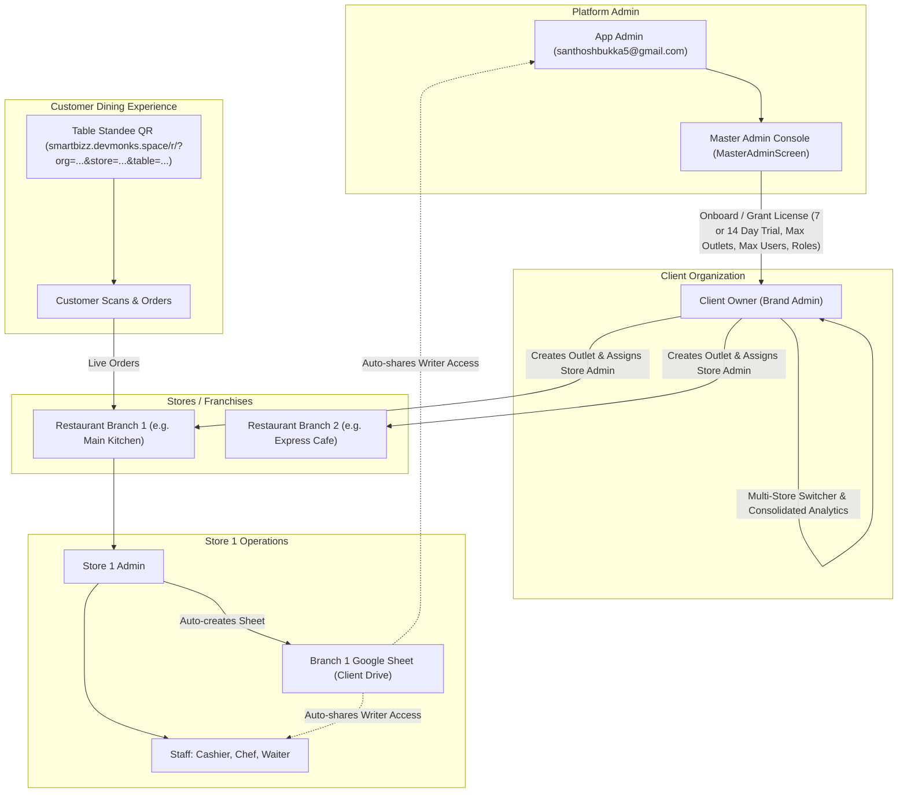

# Enterprise Client Onboarding, Google Sheet Automation & Multi-Store Hierarchy Plan

## Overview
This architectural upgrade delivers an enterprise-grade multi-tenant platform for **SmartDine Restaurant POS**, enabling:
1. **Application Admin Master Control**: App Admin (`santhoshbukka5@gmail.com`) can onboard unlimited client organizations with tailored licenses (7/14/custom day trials, max users, allowed roles, multi-store caps, feature toggles).
2. **Automated Google Sheet Provisioning & Co-Ownership**: When a client/store admin logs in with Google, the 7-tab Restaurant Google Sheet is automatically provisioned in their Google Drive and **instantly shared with App Admin** (`santhoshbukka5@gmail.com`) as writer/co-owner.
3. **Dynamic Staff Permission Sync**: Adding a staff member grants Google Sheet access; editing a staff email revokes the old email and grants the new one; deleting a staff member revokes access immediately. App Admin access is permanently safeguarded.
4. **Multi-Store / Franchise Hierarchy**: If enabled by App Admin, the Client (Org Owner) can onboard multiple restaurant branches (up to `maxFranchises`), assign a **Default Store Admin** for each branch, and seamlessly switch contexts between branches or view aggregated multi-store analytics.
5. **Table QR Ordering via `smartbizz.devmonks.space`**: Table QR standees for each table in each branch linking directly to `https://smartbizz.devmonks.space/r/?org={orgId}&store={storeId}&table={tableNumber}`.

---

## 🏛️ Enterprise Multi-Tenant Architecture



---

## 📋 Key Modules & Changes

### 1. Data Models (`lib/core/saas_models.dart`)
- **`RestaurantOutlet` (Franchise Model)**:
  - `id`: unique outlet identifier (`${orgId}_B1`, etc.)
  - `organizationId`: parent tenant ID
  - `name`: branch/outlet name (e.g. "SmartDine - Koramangala")
  - `storeAdminEmail`: email of the assigned default Store Admin
  - `storeAdminName`: name of the Store Admin
  - `googleSheetId`: dedicated Google Sheet ID for this branch
  - `googleSheetUrl`: link to the Google Sheet
  - `tableCount`: number of dining tables
  - `operatingMode`: `payFirstQSR` or `dineFirstPostpaid`
  - `address`, `phone`, `upiId`
- **`SaasLicense` Enhancements**:
  - `maxFranchises`: maximum allowed restaurant branches (1 for single store, 3/5/10+ for franchise tiers)
  - `maxUsers`: total staff accounts permitted per store
  - `allowedRoles`: list of permitted roles (`['OWNER', 'MANAGER', 'BILLING', 'KITCHEN', 'WAITER']`)
  - `features`: restaurant feature map (`tableManagement`, `qsrBilling`, `kdsEnabled`, `qrOrdering`, `dualPrinting`, `recipeInventory`, `dayEndReports`, `multiOutlet`)
- **`ClientOnboardingRequest`**:
  - Encapsulates prospective client form submissions with 7/14 day trial requests, franchise request count, user caps, and feature choices.

---

### 2. Automated Google Sheet Provisioning & Permission Sync (`lib/services/restaurant_sheets_service.dart`)
- **App Admin Auto-Sharing**:
  - In `provisionRestaurantSheet()`, immediately after creating the spreadsheet, call:
    ```dart
    await shareSpreadsheetWithStaff(
      authenticatedClient: authenticatedClient,
      spreadsheetId: newSheetId,
      staffEmail: kAdminEmail, // santhoshbukka5@gmail.com
    );
    ```
    Guarantees App Admin has instantaneous co-ownership on every client sheet at zero extra cost.
- **Dynamic Staff Permission Sync**:
  - `syncStaffPermissionsOnEdit({required String spreadsheetId, required String oldEmail, required String newEmail})`:
    - If `oldEmail != newEmail`, deletes `oldEmail` permission and creates `newEmail` permission via Drive API v3.
  - `revokeStaffAccess({required String spreadsheetId, required String email})`:
    - Deletes permission when a staff member is removed.
    - Prevents revoking `kAdminEmail` or the store owner's primary email.

---

### 3. Client Onboarding Request Form (`lib/screens/login/client_signup_screen.dart`)
- **Self-Service Request Enhancements**:
  - **Scale & Structure**: Single Restaurant vs Multi-Branch Franchise Chain (requested store count: 1, 3, 5, 10).
  - **Trial Duration Choice**: `7 Days Free Trial` or `14 Days Free Trial`.
  - **Staff User Scale**: Request 3, 5, 10, or 20 staff accounts.
  - **Required Operational Roles**: Checkboxes for Store Manager, Cashier/Billing, Kitchen Chef, Waiter/Captain.
  - **Feature Module Preferences**: Fast QSR, Table Layout, KDS Kitchen Screen, QR Menu Standees, Recipe Inventory.
- Stores request in Firestore `registration_requests` with `status: 'PENDING'`.

---

### 4. Application Admin Console (`lib/screens/dashboard/master_admin_screen.dart`)
- **Requests Review (`RegistrationRequestsTab`)**:
  - Prominently displays:
    - Trial badge: `7-Day Free Trial` or `14-Day Free Trial`
    - Scale badge: `Single Store` or `Multi-Branch Chain (X Outlets)`
    - User limit requested & permitted roles
  - **One-Click "Approve & Onboard"**:
    - Pre-populates all client choices.
    - Admin can customize or override:
      - Plan: `FREE TRIAL` (7, 14, 30, or custom days), `MONTHLY`, `YEARLY`, `LIFETIME`
      - `maxFranchises`: 1 to 50
      - `maxUsers`: 3 to 100
      - `allowedRoles`: interactive role toggles
      - `features`: restaurant feature toggles
      - Assigns default Store Admin credentials.
- **Organizations Management (`OrganizationsTab`)**:
  - Displays all onboarded restaurant brands and branches.
  - Allows editing licenses, adding outlets, extending trial days, or adjusting user limits on the fly.

---

### 5. Multi-Store Franchise Management for Client Owners (`lib/screens/restaurant/branch_management_screen.dart`)
- For clients with `maxFranchises > 1` (or `multiOutlet: true`):
  - **Brand Owner Console**:
    - View all restaurant branches with their address, tables, and assigned Store Admin.
    - **Add Restaurant Branch**: Name, address, table count, operating mode, and **assign Default Store Admin user**.
    - **Active Outlet Switcher**: Seamlessly switch active branch context without logging out to manage that store's floor, menu, and staff.
    - **Consolidated Analytics**: Aggregate sales, bills, and tokens across all branches.

---

### 6. Staff Management Screen (`lib/screens/settings/staff_management_screen.dart`)
- **Dynamic Drive Permission Management**:
  - On Add: Shares sheet with staff Google email via Drive API.
  - On Edit: If email changed, safely revokes old email and shares with new email.
  - On Delete: Revokes Drive permission for deleted staff.
- **Enforce Plan Constraints**:
  - Gates staff addition against `license.maxUsers`.
  - Restricts role assignment to `license.allowedRoles`.

---

### 7. Table QR Ordering via `smartbizz.devmonks.space` (`lib/services/table_qr_pdf_service.dart`)
- QR Code URL Blueprint:
  `https://smartbizz.devmonks.space/r/?org=${orgId}&store=${storeId}&table=${tableNumber}`
- Generates high-resolution printable table standee PDFs for each table of the selected branch.
- Customer scans the standee, opens the digital menu, and orders directly to that store's KDS & billing counter.

---

## 🧪 Verification Plan

### Automated Static Analysis
```powershell
& "C:\Users\santhosh\flutter\bin\flutter.bat" analyze
```

### End-to-End Verification Scenarios
1. **Client Self-Service Request**:
   - Prospective client submits request selecting **14 Days Free Trial**, **3 Branches**, **5 Users per store**, and **KDS + Table QR**.
   - Verified in Firestore `registration_requests`.
2. **App Admin Approval & Configuration**:
   - App Admin reviews request in `MasterAdminScreen`.
   - Onboards client with `maxFranchises: 3`, `maxUsers: 5`, trial expiry (+14 days), and restaurant feature toggles.
3. **Google Sheet Creation & App Admin Co-Ownership**:
   - Store Admin signs in with Google.
   - 7-tab Restaurant Google Sheet created in Client Drive.
   - Verified that `santhoshbukka5@gmail.com` is automatically granted `writer` permission on the newly created sheet.
4. **Staff Permission Sync (Add, Edit, Delete)**:
   - Add staff `chef@gmail.com` ➔ verified Drive permission granted.
   - Edit staff email to `chef_new@gmail.com` ➔ verified old email revoked, new email granted.
   - Delete staff ➔ verified permission revoked.
5. **Multi-Store Management & Switcher**:
   - Client Owner creates Branch 2 and assigns Store Admin 2.
   - Switches between Branch 1 and Branch 2; verified data isolation and store-specific table QR codes.
